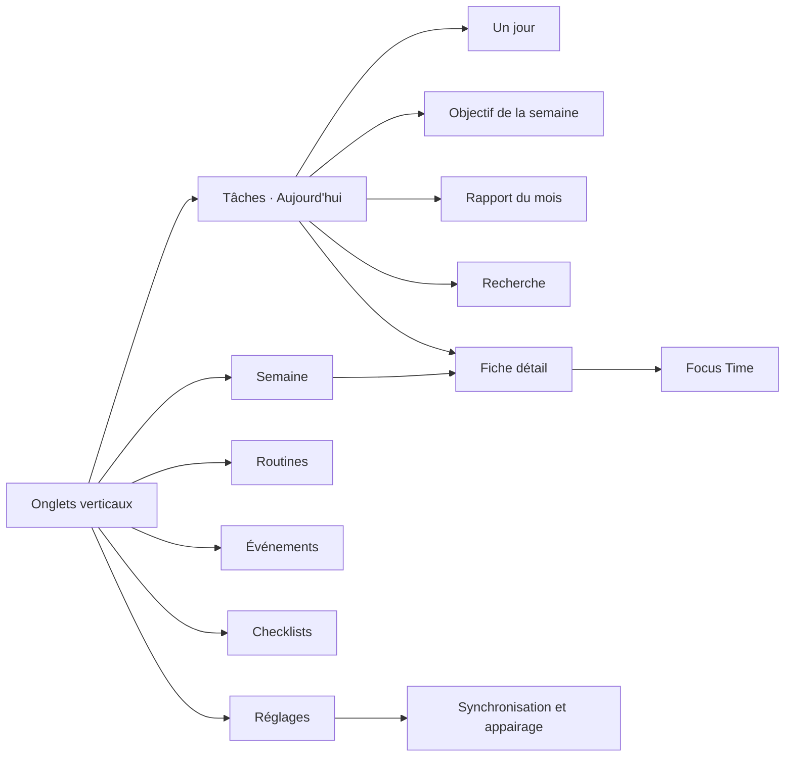
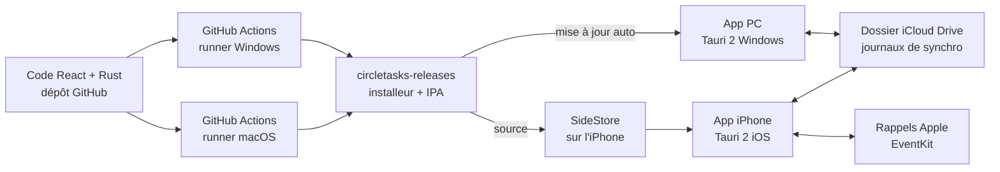
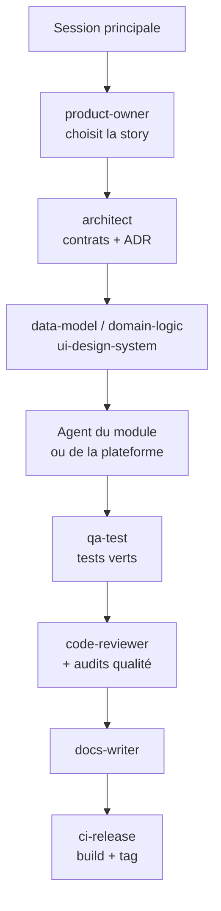

# PRD — CircleTasks

Version du 1er octobre 2026 · Auteur : Ali · Référence unique du projet

## 1. Contexte, vision et objectifs

CircleTasks est un planificateur personnel qui reproduit le périmètre complet de NoteCircle : tâches, vue semaine, routines, événements, checklists, calendriers, capture rapide, Focus Time et statistiques. L'application est développée en une seule fois et livrée en même temps sur PC Windows et sur iPhone 16 Pro Max, pour un usage strictement personnel.

**Vision.** Un seul espace minimaliste, inspiré du papier, qui répond à deux questions : « qu'est-ce que je dois faire et quand ? » et « qu'est-ce que j'ai réellement accompli ? ».

**Utilisateur cible.** Un utilisateur unique (Ali), multi-activités (missions de conseil, contrôle de gestion, projets personnels), qui planifie à la semaine et veut suivre ses routines.

**Objectifs mesurables**

| Objectif               | Indicateur                           | Cible     |
|------------------------|--------------------------------------|-----------|
| Capture rapide         | Temps de création d'une tâche simple | \< 5 s    |
| Planification hebdo    | Vue semaine chargée                  | \< 300 ms |
| Adoption               | Jours d'usage par semaine            | ≥ 5       |
| Fiabilité des rappels  | Rappels délivrés à l'heure           | ≥ 99 %    |
| Continuité PC ↔ iPhone | Données reprises sans perte          | 100 %     |

**Hors objectifs.** Pas de multi-utilisateur, pas de collaboration temps réel, pas de publication App Store, pas de monétisation (le découpage Free/Premium de NoteCircle n'est pas reproduit : tout est inclus).

**Glossaire**

| Terme            | Définition                                                                                                                           | Exemple                         |
|------------------|--------------------------------------------------------------------------------------------------------------------------------------|---------------------------------|
| Tâche            | Action ponctuelle à faire, datée ou non ; peut être récurrente sans suivi de série                                                   | Envoyer la facture              |
| Tâche récurrente | Tâche qui se recrée selon une règle (hebdo, mensuelle, annuelle) ; chaque occurrence se termine séparément                           | Payer le loyer le 5 du mois     |
| Routine          | Habitude répétée (jours de semaine, X fois par semaine, tous les N jours ou toutes les N semaines), avec série et taux de complétion | Sport lundi, mercredi, vendredi |
| Événement        | Moment daté, sans case à cocher                                                                                                      | Rendez-vous, anniversaire       |
| Checklist        | Liste nommée d'items cochables, réutilisable comme modèle                                                                            | Valise voyage                   |
| Espace           | Cloisonnement de premier niveau : Pro ou Perso                                                                                       | Pro                             |
| Projet           | Regroupement facultatif dans un espace                                                                                               | Mission client                  |
| Occurrence       | Instance datée d'une routine ou d'une tâche récurrente                                                                               | Routine Sport du 12 octobre     |

**Hors périmètre fonctionnel** — ces fonctions ne sont pas développées, et aucun agent ne doit les ajouter de lui-même :

- Sous-tâches imbriquées (les checklists couvrent le besoin).

- Niveaux de priorité, étiquettes ou tags, couleurs par tâche (seuls espaces et projets classent).

- Pièces jointes : fichiers, photos, liens enrichis (la photo d'un scan n'est pas conservée).

- Partage, collaboration, multi-utilisateur, commentaires, assignation à d'autres personnes.

- Dépendances entre tâches, diagramme de Gantt, suivi du temps hors Focus Time.

- Apple Watch, iPad, Mac, Vision Pro, Android, version web.

- Widgets, Live Activity, Dynamic Island, Siri et Raccourcis iOS.

- Assistant ou génération par IA dans l'app.

- Publicité, abonnement, fonctions verrouillées, liens vers d'autres apps.

Toute fonction absente des modules M1 à M18 est hors périmètre par défaut ; une demande nouvelle passe par une mise à jour de ce PRD.

## 2. Stratégie plateforme

PC Windows et iPhone 16 Pro Max partagent le même code React (Tauri 2 et Tauri 2 mobile) et sont livrés ensemble, sans Mac et sans compte Apple Developer payant. Les rappels ne sonnent que sur l'iPhone.

| Plateforme                  | Ordre de construction | Rôle                                                                      | Distribution                                                                                                          |
|-----------------------------|-----------------------|---------------------------------------------------------------------------|-----------------------------------------------------------------------------------------------------------------------|
| PC Windows 10/11            | 0 à 4                 | Application principale, planification au clavier                          | Installeur .msi/.exe local                                                                                            |
| iPhone 16 Pro Max (iOS 18+) | 1 bis et 5            | Capture en mobilité, seul appareil qui émet les rappels, routines du jour | IPA compilée sur un runner macOS GitHub Actions, installée et re-signée sur l'iPhone par SideStore (Apple ID gratuit) |

**Adaptations de la parité NoteCircle**

- Apple Watch, iPad, Mac et Vision Pro sont hors périmètre : pas de Mac pour les compiler et Tauri ne cible pas watchOS.

- Widgets, Live Activity, Dynamic Island et Raccourcis Siri sont hors périmètre : ils exigent des extensions natives et des App Groups, indisponibles avec un Apple ID gratuit.

- Saisie vocale : dictée Windows sur PC ; sur iPhone, dictée du clavier iOS, puis plugin Swift Tauri (framework Speech) si besoin.

- Scan papier : import d'image ou webcam sur PC ; appareil photo + plugin Swift Tauri (framework Vision) sur iPhone.

- Calendriers : Google Calendar via son API et Apple Calendar via iCloud CalDAV, sur les deux plateformes.

**Déploiement iPhone par SideStore.** SideStore est installé une seule fois depuis le PC avec iloader (câble USB), qui place aussi le fichier d'appairage. Ensuite, tout se fait sur l'iPhone : SideStore installe CircleTasks et le re-signe tous les 7 jours via un VPN local (LocalDevVPN ou StosVPN), de préférence en Wi-Fi, sans ordinateur. SideStore occupe l'une des 3 places d'un Apple ID gratuit ; s'il expire lui-même, il se réinstalle depuis le PC avec iloader. Le mode développeur doit être activé ; les données de l'app sont conservées tant qu'elle n'est pas supprimée.

**Prérequis et comptes à préparer**

| Élément                                                                                                | Pourquoi                                                                                       | Quand             | Point d'attention                                                                                                                                              |
|--------------------------------------------------------------------------------------------------------|------------------------------------------------------------------------------------------------|-------------------|----------------------------------------------------------------------------------------------------------------------------------------------------------------|
| Compte GitHub + dépôt privé `circletasks`                                                              | Code, tests, builds Windows et iOS                                                             | Avant ordre 0     | Minutes macOS limitées sur dépôt privé                                                                                                                         |
| Dépôt public `circletasks-releases`                                                                    | Publication des installeurs et du fichier `latest.json` lu par la mise à jour automatique      | Avant ordre 0     | Ne contient que les binaires, jamais le code                                                                                                                   |
| Clé de signature des mises à jour Tauri (`tauri signer generate`)                                      | Signer chaque version PC                                                                       | Avant ordre 0     | Clé privée dans GitHub Secrets et sauvegardée hors du dépôt : sa perte bloque toute mise à jour                                                                |
| Node.js LTS, Rust (rustup), Visual Studio Build Tools, WebView2                                        | Développement Tauri sur Windows                                                                | Avant ordre 0     | WebView2 est déjà présent sur Windows 11                                                                                                                       |
| Claude Code                                                                                            | Développement par agents                                                                       | Avant ordre 0     | —                                                                                                                                                              |
| Projet Google Cloud + API Calendar + écran de consentement OAuth                                       | Lecture de Google Calendar                                                                     | Avant ordre 2     | Passer l'app en « Production » : en statut « Test », la connexion expire tous les 7 jours ; l'avertissement « app non vérifiée » est acceptable en usage perso |
| Mot de passe d'application iCloud (appleid.apple.com)                                                  | Accès CalDAV à Apple Calendar                                                                  | Avant ordre 2     | Double authentification Apple requise                                                                                                                          |
| iCloud pour Windows, iCloud Drive activé                                                               | Synchronisation                                                                                | Avant ordre 4     | —                                                                                                                                                              |
| Apple ID (gratuit)                                                                                     | Signature de l'app iPhone                                                                      | Avant ordre 1 bis | 3 apps sideloadées maximum                                                                                                                                     |
| SideStore (installé via iloader sur le PC) + VPN local LocalDevVPN ou StosVPN sur l'iPhone             | Installation initiale, puis installation, mise à jour et re-signature directement sur l'iPhone | Avant ordre 1 bis | iloader exige iTunes téléchargé depuis le site d'Apple, pas depuis le Microsoft Store ; SideStore occupe 1 des 3 places de l'Apple ID gratuit                  |
| Mode développeur activé sur l'iPhone                                                                   | Lancer une app sideloadée                                                                      | Avant ordre 1 bis | Réglages \> Confidentialité et sécurité                                                                                                                        |
| Pack de langue français avec reconnaissance de texte (Paramètres Windows \> Heure et langue \> Langue) | Lire en français les photos de listes manuscrites (OCR Windows)                                | Avant ordre 3     | Sans lui, la lecture échoue ou se fait en anglais ; l'app vérifie sa présence et affiche la marche à suivre                                                    |

## 3. Périmètre fonctionnel

Le périmètre couvre 18 modules : les 14 repris de NoteCircle (dont l'objectif de la semaine et la liste « Un jour ») et 4 ajoutés pour l'usage d'Ali ; la priorité fixe l'ordre de livraison (P1 = socle, P3 = finitions).

| \#  | Module                 | Contenu                                                                                                       | Priorité | Ordre de construction                           |
|-----|------------------------|---------------------------------------------------------------------------------------------------------------|----------|-------------------------------------------------|
| M1  | Tâches                 | Création, date, heure, terminer, reporter, récurrences, historique                                            | P1       | 1                                               |
| M2  | Aujourd'hui            | Liste du jour : tâches, routines, événements, checklists                                                      | P1       | 1                                               |
| M3  | Semaine                | Vue 7 jours, glisser-déposer entre jours, navigation                                                          | P1       | 1                                               |
| M4  | Routines               | Jours de semaine, tous les N jours ou toutes les N semaines, suivi, icône, masquage dans la liste             | P1       | 1                                               |
| M5  | Rappels                | Notifications sur l'iPhone uniquement, réglages, fiabilité, fuseaux horaires                                  | P1       | 1 (données, réglages) et 5 (envoi sur l'iPhone) |
| M6  | Checklists             | Listes nommées d'items cochables, réutilisables                                                               | P2       | 2                                               |
| M7  | Événements             | Événements, anniversaires, dates importantes, jours fériés FR/TN                                              | P2       | 2                                               |
| M8  | Calendriers            | Lecture Google Calendar et Apple Calendar (iCloud), synchronisation avec l'app Rappels d'Apple (via l'iPhone) | P2       | 2                                               |
| M9  | Capture rapide         | Saisie texte, saisie vocale, photo → OCR → tâches                                                             | P2       | 3                                               |
| M10 | Focus Time             | Sessions minutées liées à une tâche, historique                                                               | P3       | 3                                               |
| M11 | Statistiques           | Vue mensuelle, taux de complétion, rapport de routines                                                        | P3       | 3                                               |
| M12 | Personnalisation       | Menu, thème, préférences, premier lancement, import, sauvegarde                                               | P3       | 3                                               |
| M13 | Espaces et projets     | Espaces Pro / Perso, projets facultatifs, filtre Pro / Perso / Tout                                           | P1       | 1                                               |
| M14 | Recherche              | Recherche plein texte sur tous les éléments, filtres                                                          | P2       | 2                                               |
| M15 | Synchronisation        | Synchro PC ↔ iPhone par iCloud Drive, conflits, état                                                          | P1       | 4                                               |
| M16 | Intégration système    | Zone de notification, démarrage auto, mise à jour PC, installation iPhone, Face ID, logs                      | P2       | 1 à 5                                           |
| M17 | Objectif de la semaine | Objectif hebdomadaire épinglé en haut de la liste, tâches rattachées, avancement, historique                  | P2       | 1                                               |
| M18 | Un jour (Someday)      | Liste des tâches sans date, à planifier plus tard, déplaçables vers un jour en un geste                       | P2       | 1                                               |

Le module Compte de NoteCircle (connexion e-mail) est remplacé par un profil local unique et par la synchronisation M15. Le découpage en espaces est posé dès l'ordre 1 car il touche toutes les tables.

## 4. Exigences fonctionnelles et user stories

Chaque user story a un identifiant stable (module-numéro) et des critères d'acceptation testables ; elles valent pour PC et iPhone sauf mention contraire.

### M1 — Tâches

| ID   | User story                                        | Critères d'acceptation                                                                                                                                                                             |
|------|---------------------------------------------------|----------------------------------------------------------------------------------------------------------------------------------------------------------------------------------------------------|
| T-01 | Je crée une tâche avec un titre seul              | Entrée valide ; tâche ajoutée à Aujourd'hui par défaut ; \< 5 s                                                                                                                                    |
| T-02 | J'affecte une date et une heure optionnelle       | Tâche visible le bon jour en Semaine ; heure affichée et triée                                                                                                                                     |
| T-03 | J'ajoute une note et une icône                    | Note multi-lignes ; choix « Icône » (icônes au trait colorées de la bibliothèque libre Lucide) ou « Emoji », affiché à droite du titre dans la liste                                               |
| T-04 | Je marque une tâche terminée                      | Case cochée, texte barré, date de fin horodatée ; annulation possible 5 s                                                                                                                          |
| T-05 | Je reporte une tâche                              | Actions « Demain », « Semaine prochaine », « Choisir une date »                                                                                                                                    |
| T-06 | Les tâches non faites passent au lendemain        | Option en réglage ; report automatique à 00:00 avec badge « reportée »                                                                                                                             |
| T-07 | Je consulte les tâches terminées                  | Liste filtrable par jour, semaine, mois                                                                                                                                                            |
| T-08 | Je supprime une tâche                             | Confirmation ; corbeille conservée 30 jours                                                                                                                                                        |
| T-09 | Je rends une tâche récurrente                     | Règles : tous les N jours, hebdomadaire (jours choisis), mensuelle (jour X ou Nᵉ jour de semaine, ex. 2ᵉ lundi), annuelle ; occurrence suivante créée dès que la précédente est terminée ou passée |
| T-10 | Je modifie ou arrête une récurrence               | Choix « cette occurrence » ou « toutes les suivantes » ; fin à une date ou après N occurrences                                                                                                     |
| T-11 | Mes heures restent justes quand je change de pays | Tâches et routines en heure locale « flottante » (10h reste 10h là où je suis) ; événements externes convertis depuis UTC ; fuseau courant affiché dans Réglages                                   |
| T-12 | Je duplique une tâche                             | Copie avec titre, note, icône, espace, projet, rappels ; date proposée à choisir ; Ctrl+Maj+D sur PC, action du menu sur iPhone                                                                    |
| T-13 | J'annule ma dernière action                       | Terminer, reporter, déplacer, dupliquer, supprimer : message « Annuler » affiché 5 s ; Ctrl+Z sur PC ; 20 dernières actions annulables dans la session                                             |
| T-14 | Je choisis une date adaptée à mon appareil        | iPhone : roue jour + heure + minutes ; PC : champ date avec mini-calendrier et saisie libre (« demain », « lun. 10h ») ; raccourcis Aujourd'hui, Demain, Un jour                                   |

### M2 — Aujourd'hui

| ID   | User story                                 | Critères d'acceptation                                                                                                                                                                                      |
|------|--------------------------------------------|-------------------------------------------------------------------------------------------------------------------------------------------------------------------------------------------------------------|
| A-01 | J'ouvre l'app sur la liste du jour         | Écran par défaut ; tâches, routines, événements, checklists du jour                                                                                                                                         |
| A-02 | Je réordonne ma liste                      | Glisser-déposer ; ordre persistant                                                                                                                                                                          |
| A-03 | Je masque les routines de la liste du jour | Interrupteur en réglage ; routines toujours visibles dans leur onglet                                                                                                                                       |
| A-04 | J'accède à Aujourd'hui en un geste         | Raccourci Alt+1 sur PC ; onglet fixe sur iPhone                                                                                                                                                             |
| A-05 | Je passe en mode édition                   | Interrupteur « − » en bas à gauche : bouton de suppression et poignée de déplacement sur chaque élément, sélection multiple (déplacer, reporter, supprimer) ; même interrupteur pour revenir au mode normal |
| A-06 | Je replie la liste en vue compacte         | Icône à deux flèches à droite de la date : une ligne par élément, heures et notes masquées ; choix mémorisé ; même icône sur Routines et Checklists                                                         |
| A-07 | J'agis d'un geste sur iPhone               | Balayer vers la droite : terminer ; vers la gauche : Reporter, Un jour, Supprimer ; appui long : fiche détail ; retour haptique ; chaque geste a un équivalent en bouton (VoiceOver)                        |
| A-08 | J'ouvre la fiche détail d'une tâche        | PC : panneau à droite ; iPhone : feuille plein écran ; titre, date, heure, récurrence, rappels, espace, projet, objectif, note ; boutons Focus, Reporter, Un jour, Dupliquer, Supprimer                     |
| A-09 | Je vois toujours l'état de l'app           | Squelettes pendant le chargement ; bandeau discret « Hors ligne », « Synchro en cours », « En attente d'iCloud » ; alerte si un agenda est déconnecté, avec bouton « Reconnecter »                          |

### M3 — Semaine

| ID   | User story                                                   | Critères d'acceptation                                                                                                              |
|------|--------------------------------------------------------------|-------------------------------------------------------------------------------------------------------------------------------------|
| S-01 | Je vois ma semaine en 7 colonnes (PC) ou 7 sections (iPhone) | Lundi premier jour ; jour courant mis en évidence                                                                                   |
| S-02 | Je déplace une tâche d'un jour à l'autre                     | Glisser-déposer ; date mise à jour immédiatement                                                                                    |
| S-03 | Je navigue entre semaines                                    | Flèches, Ctrl+← / Ctrl+→ sur PC, balayage sur iPhone ; retour « Cette semaine »                                                     |
| S-04 | Je crée une tâche directement dans un jour                   | Champ d'ajout rapide en bas de chaque jour                                                                                          |
| S-05 | Je vois les événements calendrier dans la semaine            | Événements externes en lecture seule, couleur distincte                                                                             |
| S-06 | Je planifie depuis « Un jour » en glissant                   | PC : panneau « Un jour » ouvrable à droite de la Semaine, glisser-déposer vers un jour ; iPhone : action « Planifier » sur la tâche |

### M4 — Routines

| ID   | User story                                                        | Critères d'acceptation                                                                                             |
|------|-------------------------------------------------------------------|--------------------------------------------------------------------------------------------------------------------|
| R-01 | Je crée une routine avec icône et fréquence                       | Choix : tous les jours, jours précis, X fois par semaine ; tous les N jours ou N semaines (R-07)                   |
| R-02 | J'associe une heure optionnelle                                   | Routine triée à l'heure ; rappel possible                                                                          |
| R-03 | Je valide une routine du jour                                     | Une occurrence par jour ; historique conservé                                                                      |
| R-04 | Je suis ma série                                                  | Série en cours et meilleure série affichées                                                                        |
| R-05 | Je mets une routine en pause ou l'archive                         | Aucune occurrence générée pendant la pause ; historique intact                                                     |
| R-06 | Je consulte le rapport de routine                                 | Taux de complétion sur 7, 30, 90 jours ; carte de chaleur mensuelle                                                |
| R-07 | Je planifie une routine tous les N jours ou toutes les N semaines | N de 2 à 30 jours ou de 2 à 8 semaines ; date de départ choisie ; compteur et séries calculés sur les jours prévus |

### M5 — Rappels

| ID   | User story                                           | Critères d'acceptation                                                                                                                                                                                    |
|------|------------------------------------------------------|-----------------------------------------------------------------------------------------------------------------------------------------------------------------------------------------------------------|
| N-01 | Je reçois un rappel à l'heure d'une tâche            | Notification iOS sur l'iPhone uniquement, jamais sur le PC ; ≤ 60 s de décalage                                                                                                                           |
| N-02 | Je choisis une avance (0, 5, 15, 30, 60 min, 1 jour) | Plusieurs rappels par élément possibles                                                                                                                                                                   |
| N-03 | Je termine ou reporte depuis la notification         | Actions « Fait » et « +15 min »                                                                                                                                                                           |
| N-04 | Je règle un récapitulatif matin et soir              | Heures configurables ; contenu = liste du jour / non fait                                                                                                                                                 |
| N-05 | Les rappels survivent au redémarrage                 | Notifications locales planifiées sur l'iPhone, recalculées à chaque ouverture et à chaque synchro ; le PC n'en émet aucune                                                                                |
| N-06 | Mes rappels suivent mon changement de fuseau         | Replanification automatique à la détection d'un nouveau fuseau ; aucun rappel perdu ni doublé                                                                                                             |
| N-07 | Un rappel créé sur le PC sonne sur l'iPhone          | Planifié sur l'iPhone à sa synchro suivante ; sur PC, avertissement si le rappel est à moins de 2 h et que l'iPhone ne s'est pas synchronisé depuis 2 h ; le récapitulatif du matin invite à ouvrir l'app |

### M6 — Checklists

| ID   | User story                          | Critères d'acceptation                                                                                                                                             |
|------|-------------------------------------|--------------------------------------------------------------------------------------------------------------------------------------------------------------------|
| C-01 | Je crée une checklist nommée        | Items ajoutés à la chaîne par Entrée                                                                                                                               |
| C-02 | Je coche des items                  | Progression « 3/5 » affichée                                                                                                                                       |
| C-03 | J'associe une checklist à un jour   | Visible dans Aujourd'hui et Semaine                                                                                                                                |
| C-04 | Je réutilise une checklist modèle   | « Dupliquer et réinitialiser » (ex. valise voyage)                                                                                                                 |
| C-05 | J'efface d'un coup les items cochés | Bouton « Effacer les cochés » avec confirmation, annulable 5 s ; option « Tout décocher » pour réutiliser la liste ; bouton « Réorganiser » pour l'ordre des items |

### M7 — Événements

| ID   | User story                                     | Critères d'acceptation                                                                                                                                                                                                                             |
|------|------------------------------------------------|----------------------------------------------------------------------------------------------------------------------------------------------------------------------------------------------------------------------------------------------------|
| E-01 | Je crée un événement daté, avec ou sans heure  | Journée entière ou plage horaire ; répétition Une fois / Mensuel / Annuel ; case « commence et finit le même jour »                                                                                                                                |
| E-02 | Je crée un anniversaire ou une date importante | Récurrence annuelle ; année de naissance facultative, âge affiché seulement si elle est renseignée                                                                                                                                                 |
| E-03 | J'affiche les jours fériés                     | Calendriers France et Tunisie activables séparément ; fêtes religieuses tunisiennes (Aïd el-Fitr, Aïd el-Idha, Ras el am el hejri, Mouled) lues dans une table mise à jour chaque année, date modifiable à la main si l'annonce officielle diffère |
| E-04 | Je vois un compte à rebours                    | « J-12 » sur les événements marqués importants                                                                                                                                                                                                     |

### M8 — Calendriers externes

| ID   | User story                                          | Critères d'acceptation                                                                                                                                                                                                       |
|------|-----------------------------------------------------|------------------------------------------------------------------------------------------------------------------------------------------------------------------------------------------------------------------------------|
| K-01 | Je connecte Google Calendar                         | OAuth ; choix des agendas affichés                                                                                                                                                                                           |
| K-02 | Je connecte Apple Calendar                          | iCloud CalDAV avec mot de passe d'application, sur PC et iPhone                                                                                                                                                              |
| K-03 | Mes événements externes se mettent à jour           | Rafraîchissement à l'ouverture et toutes les 15 min                                                                                                                                                                          |
| K-04 | Je crée une tâche depuis un événement externe       | Tâche liée, même date                                                                                                                                                                                                        |
| K-05 | Je vois mes Rappels Apple dans CircleTasks          | Sur iPhone, lecture des listes Rappels choisies (EventKit) ; chaque liste rattachée à un espace ; rappels affichés comme tâches à leur date, sans date dans « Un jour »                                                      |
| K-06 | Je coche un rappel dans CircleTasks ou dans Rappels | Titre, date et statut terminé synchronisés dans les deux sens sur l'iPhone ; création d'un rappel Apple depuis CircleTasks en option                                                                                         |
| K-07 | Je retrouve mes Rappels Apple sur le PC             | Pas d'accès direct à Rappels sous Windows : les rappels importés sur l'iPhone arrivent sur le PC par la synchro iCloud Drive (M15) ; les modifications faites sur PC repartent vers Rappels au prochain passage sur l'iPhone |

### M9 — Capture rapide

| ID   | User story                                    | Critères d'acceptation                                                                                                                                      |
|------|-----------------------------------------------|-------------------------------------------------------------------------------------------------------------------------------------------------------------|
| Q-01 | J'ajoute une tâche depuis n'importe où sur PC | Raccourci global (ex. Ctrl+Alt+Espace) ouvrant une mini-fenêtre                                                                                             |
| Q-02 | Je saisis en langage naturel                  | « Appeler le notaire demain 10h » → date et heure détectées (FR)                                                                                            |
| Q-03 | Je dicte une tâche                            | Transcription FR ; relecture avant validation                                                                                                               |
| Q-04 | Je photographie une liste manuscrite          | OCR → une ligne = une tâche proposée ; cases à cocher pour choisir                                                                                          |
| Q-05 | Je capture vite depuis l'iPhone               | Bouton + flottant actif dès l'ouverture ; champ prêt à la saisie (widgets et Siri hors périmètre)                                                           |
| Q-06 | Je choisis espace et projet en tapant         | « \#pro », « \#perso » et « @projet » reconnus dans la saisie, retirés du titre, suggestions à la frappe ; ex. « Relancer client demain 9h \#pro @mission » |

### M10 — Focus Time

| ID   | User story                         | Critères d'acceptation                                |
|------|------------------------------------|-------------------------------------------------------|
| F-01 | Je lance une session sur une tâche | Durées 25/50/90 min ou libre ; minuteur visible       |
| F-02 | Je fais une pause                  | Pause/reprise ; temps réel comptabilisé               |
| F-03 | Je vois mon temps de concentration | Total par jour, semaine, tâche                        |
| F-04 | La fin de session me notifie       | Son + notification ; proposition de terminer la tâche |

### M11 — Statistiques

| ID   | User story                              | Critères d'acceptation                                          |
|------|-----------------------------------------|-----------------------------------------------------------------|
| H-01 | Je vois ce que j'ai accompli ce mois-ci | Vue mensuelle : tâches faites, routines validées, événements    |
| H-02 | Je vois mon taux de complétion          | Par semaine et par mois, en graphique                           |
| H-03 | J'exporte mon historique                | Export CSV et JSON ; rapport mensuel exporté en PDF ou en image |

### M12 — Personnalisation

| ID   | User story                                                          | Critères d'acceptation                                                                                                                                                                                                                                                                                           |
|------|---------------------------------------------------------------------|------------------------------------------------------------------------------------------------------------------------------------------------------------------------------------------------------------------------------------------------------------------------------------------------------------------|
| P-01 | Je réordonne et masque les onglets                                  | Glisser-déposer en réglage                                                                                                                                                                                                                                                                                       |
| P-02 | Je choisis clair, sombre ou système                                 | Changement instantané                                                                                                                                                                                                                                                                                            |
| P-03 | Je règle le premier jour de semaine, la langue et le format d'heure | Défaut : lundi, français, 24 h                                                                                                                                                                                                                                                                                   |
| P-04 | Je sauvegarde et restaure mes données                               | Sauvegarde automatique quotidienne locale ; restauration en 1 clic                                                                                                                                                                                                                                               |
| P-05 | Je suis guidé au premier lancement                                  | 4 écrans maximum : langue et semaine ; espaces Pro / Perso ; association PC ↔ iPhone par QR code et choix du dossier iCloud (passable, puis accessible dans Réglages) ; sur iPhone seulement, autorisation des notifications ; données d'exemple en option ; passable à tout moment ; relançable depuis Réglages |
| P-06 | Un écran vide m'indique quoi faire                                  | Chaque écran vide affiche un message et une action (ex. « Aucune tâche aujourd'hui — Ajouter »)                                                                                                                                                                                                                  |
| P-07 | J'importe mes tâches existantes                                     | Import CSV (titre ; date ; heure ; espace ; projet ; note) ; aperçu avant import ; rapport des lignes rejetées ; import annulable                                                                                                                                                                                |
| P-08 | Je consulte les raccourcis clavier                                  | Ctrl+/ affiche la liste complète (section 5)                                                                                                                                                                                                                                                                     |

### M13 — Espaces et projets

| ID    | User story                                            | Critères d'acceptation                                                                                                                                     |
|-------|-------------------------------------------------------|------------------------------------------------------------------------------------------------------------------------------------------------------------|
| ES-01 | J'ai deux espaces Pro et Perso                        | Créés par défaut ; renommables ; une couleur chacun                                                                                                        |
| ES-02 | Chaque élément appartient à un espace                 | Tâches, routines, événements, checklists ; espace par défaut = espace actif                                                                                |
| ES-03 | Je filtre Pro / Perso / Tout                          | Sélecteur en haut d'écran ; filtre appliqué à Aujourd'hui, Semaine, Statistiques, Recherche ; choix mémorisé ; en « Tout », pastille de couleur par espace |
| ES-04 | Je crée des projets dans un espace                    | Facultatifs ; nom, couleur, archivage ; filtre par projet                                                                                                  |
| ES-05 | Je déplace un élément d'un espace ou projet à l'autre | Depuis le détail ou par lot (sélection multiple)                                                                                                           |
| ES-06 | Je rattache un agenda externe à un espace             | Chaque agenda Google ou iCloud affecté à Pro ou Perso                                                                                                      |
| ES-07 | Je définis des plages silencieuses par espace         | Ex. aucun rappel Pro de 19:00 à 08:00 et le week-end ; rappels décalés à la fin de la plage                                                                |
| ES-08 | Je vois statistiques et Focus par espace et projet    | Filtres dans M10 et M11                                                                                                                                    |

### M14 — Recherche

| ID    | User story                          | Critères d'acceptation                                                                                                   |
|-------|-------------------------------------|--------------------------------------------------------------------------------------------------------------------------|
| RC-01 | Je cherche n'importe quel élément   | Ctrl+K sur PC, champ en haut sur iPhone ; titre, note, items de checklist ; insensible aux accents ; résultats \< 200 ms |
| RC-02 | Je filtre les résultats             | Espace, projet, type, statut (à faire / fait), période                                                                   |
| RC-03 | J'ouvre un résultat                 | Résultats groupés par type ; navigation clavier ; ouverture du détail                                                    |
| RC-04 | Je retrouve mes recherches récentes | 10 dernières recherches, effaçables                                                                                      |

### M15 — Synchronisation

| ID   | User story                                   | Critères d'acceptation                                                                                                                                                                                              |
|------|----------------------------------------------|---------------------------------------------------------------------------------------------------------------------------------------------------------------------------------------------------------------------|
| Y-01 | Je choisis le dossier de synchro             | Une fois par appareil (iCloud Drive/CircleTasks) ; choix mémorisé après redémarrage                                                                                                                                 |
| Y-02 | Mes données se synchronisent seules          | À l'ouverture, à la fermeture, toutes les 5 min en premier plan ; indicateur d'état et heure de dernière synchro                                                                                                    |
| Y-03 | Je lance une synchro manuelle                | Bouton dans Réglages et dans la zone de notification PC                                                                                                                                                             |
| Y-04 | Je consulte les conflits                     | Journal : élément, champ, valeur gardée, valeur écartée, appareil, date ; restauration de la valeur écartée en 1 clic                                                                                               |
| Y-05 | Je travaille hors ligne                      | Modifications conservées et envoyées au retour ; aucune perte                                                                                                                                                       |
| Y-06 | Je raccorde un nouvel appareil               | Association par QR code affiché sur le PC et scanné par l'iPhone (Réglages → Synchronisation → Associer) ; l'iPhone récupère l'instantané complet puis les journaux ; progression affichée                          |
| Y-07 | Mes deux appareils n'ont pas la même version | Chaque ligne de journal porte la version du schéma ; un appareil plus ancien garde les champs inconnus sans les effacer et affiche « Mettez à jour l'app » ; lecture suspendue si la version majeure est supérieure |
| Y-08 | Mes données dans iCloud sont chiffrées       | Journaux et instantané chiffrés (AES-256-GCM) ; clé créée au premier appairage, transmise du PC à l'iPhone par QR code, gardée dans le coffre de chaque appareil, jamais dans iCloud ; clé de secours imprimable    |
| Y-09 | Un élément supprimé ne réapparaît jamais     | Trace de suppression conservée tant que tous les appareils ne l'ont pas lue, puis 30 jours ; un appareil hors ligne plus de 180 jours repart de l'instantané                                                        |

### M16 — Intégration système

| ID   | User story                                      | Critères d'acceptation                                                                                                                                                                                                                 |
|------|-------------------------------------------------|----------------------------------------------------------------------------------------------------------------------------------------------------------------------------------------------------------------------------------------|
| D-01 | L'app PC reste active en zone de notification   | Fermer la fenêtre la réduit ; menu : ouvrir, ajout rapide, synchro, quitter                                                                                                                                                            |
| D-02 | L'app PC démarre avec Windows                   | Activable en réglage ; démarrage réduit                                                                                                                                                                                                |
| D-03 | Je mets à jour l'app PC                         | Vérification automatique au lancement et toutes les 24 h ; nouvelle version proposée avec ses notes ; installation en 1 clic puis redémarrage ; signature vérifiée ; aucune perte de données ; vérification manuelle dans « À propos » |
| D-04 | J'utilise les raccourcis clavier                | Tous les raccourcis de la section 5 fonctionnels ; raccourci global configurable                                                                                                                                                       |
| I-01 | J'installe l'app sur l'iPhone                   | Procédure docs/install-iphone.md suivie en \< 15 min                                                                                                                                                                                   |
| I-02 | Je suis prévenu avant l'expiration hebdomadaire | Notification locale 24 h avant la fin des 7 jours ; date d'expiration affichée dans « À propos »                                                                                                                                       |
| I-03 | Je protège l'app par Face ID                    | Option ; repli code de l'iPhone                                                                                                                                                                                                        |
| I-04 | Je consulte et exporte les logs                 | Écran de logs (erreurs, synchro, notifications) ; export texte partageable                                                                                                                                                             |
| I-05 | Les autorisations sont demandées au bon moment  | Caméra, micro, notifications demandés à la première utilisation, avec explication                                                                                                                                                      |
| I-06 | Je mets à jour l'app iPhone depuis SideStore    | Source CircleTasks ajoutée une fois dans SideStore ; nouvelle version visible avec ses notes ; installation en 1 tap ; données conservées                                                                                              |

### M17 — Objectif de la semaine

| ID    | User story                               | Critères d'acceptation                                                                                                       |
|-------|------------------------------------------|------------------------------------------------------------------------------------------------------------------------------|
| OB-01 | Je fixe un objectif pour la semaine      | Accès par l'icône cible en haut d'Aujourd'hui ; titre, icône ou emoji, espace ; un ou plusieurs objectifs par semaine        |
| OB-02 | J'épingle l'objectif en haut de ma liste | Interrupteur « Épinglé en haut de la liste » ; objectif affiché en tête d'Aujourd'hui, encadré, tous les jours de la semaine |
| OB-03 | Je rattache une tâche à un objectif      | Interrupteur « Rattacher à mon objectif » dans la fenêtre d'ajout et le détail ; icône cible sur la tâche                    |
| OB-04 | Je vois l'avancement de l'objectif       | Tâches rattachées faites / total ; objectif marquable comme atteint                                                          |
| OB-05 | Je reconduis un objectif non atteint     | Proposition le lundi suivant : reconduire ou clore ; tâches non faites reportées si reconduit                                |
| OB-06 | Je consulte mes objectifs passés         | Historique par semaine dans Statistiques : atteint ou non, tâches rattachées                                                 |

### M18 — Un jour (Someday)

| ID    | User story                                    | Critères d'acceptation                                                                                           |
|-------|-----------------------------------------------|------------------------------------------------------------------------------------------------------------------|
| SD-01 | J'ajoute une tâche sans date dans « Un jour » | Accès par l'icône horloge en haut d'Aujourd'hui ; saisie rapide sans date ; nombre de tâches affiché sur l'icône |
| SD-02 | Je planifie une tâche « Un jour » en un geste | Boutons « Aujourd'hui », « Demain », « Choisir une date » ; la tâche quitte la liste « Un jour »                 |
| SD-03 | Je renvoie une tâche datée vers « Un jour »   | Action « Plus tard » depuis Aujourd'hui, Semaine ou la notification ; date retirée                               |
| SD-04 | J'organise la liste « Un jour »               | Réordonnancement, filtre espace et projet, mode édition et vue compacte comme Aujourd'hui                        |

## 5. Écrans et navigation

Sur iPhone comme sur PC, la navigation passe par des onglets verticaux colorés sur le bord gauche, à la manière de NoteCircle ; sur PC s'y ajoute un panneau de détail à droite, sur iPhone des feuilles modales.



Tous les écrans de liste ouvrent la même fiche détail ; Focus Time se lance depuis cette fiche ; l'appairage se fait depuis Réglages.

| Écran                       | PC Windows                                                                                                          | iPhone 16 Pro Max                                                                           |
|-----------------------------|---------------------------------------------------------------------------------------------------------------------|---------------------------------------------------------------------------------------------|
| Aujourd'hui                 | Onglet vert « Tâches » : liste centrale + détail à droite                                                           | Onglet vert « Tâches », liste pleine hauteur                                                |
| Semaine                     | Onglet violet clair « Semaine » : 7 colonnes côte à côte                                                            | Onglet violet clair « Semaine » : 7 jours en sections verticales défilantes                 |
| Routines                    | Onglet rose : liste + rapport à droite                                                                              | Onglet rose ; rapport mensuel en feuille                                                    |
| Événements                  | Onglet bleu : liste par année (← 2026 →) + calendrier                                                               | Onglet bleu ; bouton « Calendrier »                                                         |
| Checklists                  | Onglet beige : sélecteur de liste + items                                                                           | Onglet beige ; sélecteur déroulant de liste                                                 |
| Réglages                    | Onglet gris, en bas de la colonne                                                                                   | Onglet gris, en bas de la colonne                                                           |
| Objectif de la semaine      | Icône cible en haut d'Aujourd'hui                                                                                   | Icône cible en haut d'Aujourd'hui, écran plein                                              |
| Statistiques                | Icône graphique en haut d'Aujourd'hui                                                                               | Icône graphique en haut d'Aujourd'hui, écran plein                                          |
| Focus Time                  | Bouton « Focus » de la fiche détail ou Ctrl+Maj+F ; mini-fenêtre toujours au premier plan ; seul son émis par le PC | Bouton « Focus » de la fiche détail ; plein écran, minuteur + notification de fin planifiée |
| Capture rapide              | Fenêtre flottante par raccourci global                                                                              | Bouton + rond violet en bas à droite, sur tous les onglets                                  |
| Scan papier                 | Import image / webcam                                                                                               | Bouton « Scan tâches » sous le champ Ajouter                                                |
| Recherche                   | Palette Ctrl+K superposée                                                                                           | Loupe en haut d'Aujourd'hui, écran de résultats                                             |
| Sélecteur d'espace          | Pastilles Pro / Perso / Tout en haut de chaque écran                                                                | Pastilles en haut de chaque écran                                                           |
| Premier lancement           | Assistant en fenêtre centrée, 4 étapes                                                                              | Assistant plein écran, 4 étapes                                                             |
| Synchro, logs, « À propos » | Réglages                                                                                                            | Réglages                                                                                    |
| Un jour (Someday)           | Icône horloge en haut d'Aujourd'hui ; liste en panneau                                                              | Icône horloge en haut d'Aujourd'hui, écran plein                                            |
| Fiche détail d'une tâche    | Panneau à droite de la liste (maquette PC — Aujourd'hui)                                                            | Feuille plein écran ouverte par un toucher ou un appui long                                 |
| Appairage PC ↔ iPhone       | Réglages → Synchronisation → Associer l'iPhone : fenêtre avec QR code et clé de secours                             | Réglages → Synchronisation → Associer au PC : écran de scan, puis choix du dossier iCloud   |

**Principes d'interface**

- Style inspiré de NoteCircle : grands titres dans une police à empattements (ex. « 23 mer. », « Routine »), texte courant sans empattements, violet foncé sur fond blanc, colonne d'onglets sur fond violet foncé ; thème sombre équivalent.

- Couleurs validées : texte et colonne d'onglets \#2E2150, bouton + \#3A2A66, onglets Tâches \#B9C8A3, Semaine \#C9BEE6, Routines \#F2A7A0, Événements \#9DBBC9, Checklists \#E8DFC0, Réglages \#CFCFD4, onglet actif blanc ; espace Pro \#2F6B7A, espace Perso \#B5483B ; objectif \#3F7FC4 ; texte secondaire \#5E557A. Polices : Fraunces pour les titres, DM Sans pour le texte, embarquées dans l'app (licence SIL OFL) et jamais chargées depuis Internet ; icônes Lucide au trait, colorées.

- Bouton + rond violet toujours visible en bas à droite (repris de NoteCircle 4.04).

- Une seule base React avec deux mises en page : PC (≥ 1 024 px, onglets + liste + détail) et mobile (440 × 956 points de l'iPhone 16 Pro Max, onglets + liste) ; zones tactiles ≥ 44 points, marges de sécurité iOS respectées.

- Sans Mac, la mise en page mobile se teste d'abord dans Chrome en mode appareil à 440 × 956, puis sur l'iPhone.

- PC : navigation complète au clavier, fenêtre minimale 1 024 × 700 px.

**Raccourcis clavier PC**

| Raccourci                | Action                                              | Portée                   |
|--------------------------|-----------------------------------------------------|--------------------------|
| Ctrl+Alt+Espace          | Capture rapide (configurable)                       | Global, même app réduite |
| Ctrl+N                   | Nouvelle tâche                                      | Application              |
| Ctrl+K                   | Recherche                                           | Application              |
| Alt+1                    | Aller à l'onglet Tâches (Aujourd'hui)               | Application              |
| Alt+2 à Alt+6            | Semaine, Routines, Événements, Checklists, Réglages | Application              |
| Ctrl+← / Ctrl+→          | Semaine précédente / suivante                       | Semaine                  |
| Ctrl+1 / Ctrl+2 / Ctrl+3 | Espace Pro / Perso / Tout                           | Application              |
| Espace                   | Terminer / rouvrir l'élément sélectionné            | Listes                   |
| Entrée                   | Ouvrir le détail                                    | Listes                   |
| ↑ / ↓                    | Élément précédent / suivant                         | Listes                   |
| Alt+↑ / Alt+↓            | Déplacer l'élément dans la liste                    | Listes                   |
| Ctrl+D                   | Reporter à demain                                   | Listes                   |
| Suppr                    | Supprimer (vers la corbeille)                       | Listes                   |
| Ctrl+Z                   | Annuler la dernière action                          | Application              |
| Ctrl+Maj+F               | Lancer une session Focus sur l'élément              | Listes                   |
| Ctrl+,                   | Réglages                                            | Application              |
| Ctrl+/                   | Liste des raccourcis                                | Application              |
| Échap                    | Fermer le panneau ou la fenêtre active              | Application              |
| Ctrl+Maj+D               | Dupliquer l'élément                                 | Listes                   |

**Maquettes filaires**

Les maquettes visuelles font référence pour l'apparence : [Maquettes CircleTasks](maquettes/index.html) (copie locale dans docs/maquettes/) (34 écrans : 21 iPhone dont la fiche détail, les gestes de balayage, l'appairage et la routine « tous les N jours », 9 PC dont l'appairage par QR code, le choix de la date, le panneau « Un jour » et l'avertissement de rappel, et 4 variantes de l'écran Aujourd'hui : sombre, édition, compacte, vide). Les croquis ci-dessous restent indicatifs.

PC — Aujourd'hui

    ┌──────────────┬───────────────────────────────┬──────────────────────┐
    │ [Pro|Perso|Tout]  Aujourd'hui · mer. 14 oct.  🔍 Ctrl+K           │
    │              ├───────────────────────────────┼──────────────────────┤
    │ ● Aujourd'hui│ ÉVÉNEMENTS                    │ DÉTAIL               │
    │   Semaine    │  10:00 Point client (Google)  │ Titre                │
    │   Routines   │ ROUTINES                      │ Date · Heure         │
    │   Événements │  [ ] 🏃 Sport                 │ Espace · Projet      │
    │   Checklists │ TÂCHES                        │ Récurrence           │
    │   Stats      │  [ ] 09:00 Envoyer facture    │ Rappels              │
    │   Focus      │  [x] Relire contrat           │ Note                 │
    │              │ CHECKLISTS                    │ [Focus] [Reporter]   │
    │ ⚙ Réglages   │  Valise 3/5                   │                      │
    │              │ [+ Ajouter une tâche]         │                      │
    └──────────────┴───────────────────────────────┴──────────────────────┘

PC — Semaine

    ┌ ◀ Semaine 42 ▶ ─────────────────────────────── [Cette semaine] ┐
    │ Lun 12 │ Mar 13 │ Mer 14 │ Jeu 15 │ Ven 16 │ Sam 17 │ Dim 18   │
    │ ─────  │ ─────  │ ●───── │ ─────  │ ─────  │ ─────  │ ─────    │
    │ tâche  │ tâche  │ tâche  │        │ évén.  │        │          │
    │ routine│        │ routine│ tâche  │        │ routine│          │
    │ + …    │ + …    │ + …    │ + …    │ + …    │ + …    │ + …      │
    └─────────────────────────────────────────────────────────────────┘

iPhone — Aujourd'hui

    ┌───┬──────────────────────────┐
    │   │ [Pro][Perso][Tout] ⏱ 🎯 📊 🔍 │
    │ T │ sept. 2026               │
    │ o │ 23 mer. [AUJOURD'HUI]    │
    │ d │ ────────────────────     │
    │ o │ 🎯 Objectif : Finir PRD  │
    │───│ ( ) Envoyer facture   📄 │
    │ S │     09:00                │
    │ e │ ( ) Boire de l'eau    🥛 │
    │ m │     08:30                │
    │───│ (✓) Faire mon lit (barré) │
    │ R │ ┌──────────────────────┐ │
    │ o │ │ Ajouter              │ │
    │ u │ └──────────────────────┘ │
    │───│ [Scan tâches]            │
    │ E │                          │
    │ v │                          │
    │───│                          │
    │ C │                          │
    │ h │                          │
    │───│                          │
    │ ⚙ │                      (+) │
    └───┴──────────────────────────┘

**Détails d'interface repris de NoteCircle**

- Aujourd'hui : date en grand (« 23 mer. ») sous le mois, badge « AUJOURD'HUI » ; objectif épinglé en tête ; routines du jour mêlées aux tâches avec leur icône à droite ; éléments terminés barrés et descendus en bas ; champ « Ajouter » directement dans la liste ; bouton « Scan tâches » dessous ; icônes d'accès rapide en haut à droite (horloge « Un jour », cible « Objectif », graphique « Rapport mensuel ») ; interrupteur « − » du mode édition en bas à gauche ; icône à deux flèches de la vue compacte à droite de la date.

- Fenêtre d'ajout : champ titre, choix « Icône / Emoji » avec rangée d'icônes défilante, roue jour + heure + minutes sur iPhone (« Aujourd'hui » en tête), champ date avec mini-calendrier et saisie libre sur PC, répétition « Une fois / Mensuel / Annuel », case « commence et finit le même jour », rappels rapides « À l'heure / 30 minutes / 1 heure » (autres avances dans « Plus »), interrupteur « Rattacher à mon objectif », bouton « Enregistrer » grisé tant que le titre est vide.

- Routines : chaque carte affiche icône, titre, 7 ronds L M M J V S D remplis quand la routine est faite ce jour-là, compteur « 1/7 », heure et bouton « Éditer » ; bouton « Rapport du mois » en bas ; phrase d'aide sous la liste.

- Événements : navigation par année ; bouton « Calendrier » ; les événements s'affichent en tête de la liste Aujourd'hui à leur date.

- Checklists : sélecteur déroulant de la liste active, bouton « Réorganiser », crayon de modification, items en cartes grises, bouton « Effacer les cochés ».

- États vides : phrase d'accroche, 3 icônes Lucide sur pastilles de couleur et une phrase d'explication.

**À ne pas reproduire**

- Mélange anglais / français (« Add », « How it works ») : interface entièrement en français.

- Heures au format AM/PM : format 24 h.

- Coquille de date (« sept..2026 »).

- Verrous premium : toutes les fonctions sont incluses.

- Lien publicitaire vers une autre app (« DayCircle? »).

- Illustrations propriétaires de NoteCircle : remplacées par des icônes au trait colorées de la bibliothèque libre Lucide (licence ISC), comme dans les maquettes.

## 6. Modèle de données

Le modèle compte 18 tables SQLite communes au PC et à l'iPhone ; chaque ligne métier porte un identifiant UUID, `created_at`, `updated_at`, `deleted_at` et `device_id` pour permettre la synchronisation.

| Table            | Champs principaux                                                                                                                                                                                                                                       | Relations                                                                         |
|------------------|---------------------------------------------------------------------------------------------------------------------------------------------------------------------------------------------------------------------------------------------------------|-----------------------------------------------------------------------------------|
| space            | name, color, sort_order, quiet_hours (JSON : plages silencieuses)                                                                                                                                                                                       | 1 → n project, task, routine, event, checklist                                    |
| project          | space_id, name, color, archived, sort_order                                                                                                                                                                                                             | n → 1 space ; 1 → n task                                                          |
| task             | space_id, project_id, title, note, date, time (heure locale flottante), status (todo/done), done_at, sort_order, carried_over, recurrence_id, series_index, goal_id, icon (icône Lucide ou emoji), someday, source (local/apple_reminders), external_id | → space, → project, → recurrence, → checklist (option), → external_event (option) |
| recurrence       | freq (daily/weekly/monthly/yearly), interval, weekdays, month_day, nth_weekday, until, count                                                                                                                                                            | 1 → n task                                                                        |
| routine          | space_id, title, icon, schedule_type (daily/weekdays/x_per_week/every_n_days/every_n_weeks), weekdays, times_per_week, interval, start_date, time, paused, archived                                                                                     | 1 → n routine_log                                                                 |
| routine_log      | routine_id, date, done_at                                                                                                                                                                                                                               | n → 1 routine ; unique (routine_id, date)                                         |
| event            | space_id, title, start, end, all_day, kind (event/birthday/important), repeat (once/monthly/yearly), important, icon, birth_year (facultatif)                                                                                                           | → space                                                                           |
| checklist        | space_id, title, date (option), is_template                                                                                                                                                                                                             | 1 → n checklist_item                                                              |
| checklist_item   | checklist_id, text, checked, sort_order                                                                                                                                                                                                                 | n → 1 checklist                                                                   |
| reminder         | target_type (task/routine/event), target_id, offset_min, fire_at, delivered                                                                                                                                                                             | n → 1 élément ciblé                                                               |
| focus_session    | task_id (option), space_id, planned_min, started_at, ended_at, paused_sec                                                                                                                                                                               | n → 1 task                                                                        |
| calendar_account | provider (google/icloud), label, token_ref, calendars (JSON : id, nom, space_id, affiché)                                                                                                                                                               | 1 → n external_event                                                              |
| external_event   | account_id, calendar_id, external_id, title, start_utc, end_utc, all_day, synced_at                                                                                                                                                                     | lecture seule                                                                     |
| settings         | key, value (JSON)                                                                                                                                                                                                                                       | clé unique ; préférences, onboarding terminé, fuseau courant                      |
| sync_state       | device_id, device_name, last_cursor_other, last_sync_at, folder_bookmark_ref                                                                                                                                                                            | une ligne par appareil distant                                                    |
| conflict_log     | table_name, row_id, field, kept_value, discarded_value, kept_device, discarded_device, resolved_at, restored                                                                                                                                            | historique des conflits                                                           |
| goal             | space_id, week_start (lundi), title, icon, pinned, status (open/achieved/closed), carried_from_id                                                                                                                                                       | n → 1 space ; 1 → n task                                                          |
| holiday          | country (FR/TN), date, name, kind (fixed/computed/lunar), source (table annuelle/saisie manuelle), overridden                                                                                                                                           | référence ; la saisie manuelle prime sur la table annuelle                        |

Une table virtuelle `search_index` (SQLite FTS5, tokeniseur `unicode61 remove_diacritics`) indexe titres, notes et items de checklist ; elle est reconstruite localement et n'est pas synchronisée.

**Règles de gestion**

- Les occurrences de routines ne sont pas stockées d'avance : elles sont calculées à l'affichage ; seules les validations sont écrites dans `routine_log`.

- Une tâche récurrente ne stocke que l'occurrence en cours ; la suivante est créée quand elle est terminée ou que sa date est passée.

- Heures des tâches, routines et rappels en heure locale flottante (sans fuseau) ; événements externes en UTC, convertis à l'affichage.

- Les jours fériés FR et TN sont une table de référence embarquée, mise à jour avec l'app.

- Les jetons OAuth et mots de passe sont stockés dans le coffre du système (Gestionnaire d'identification Windows, Trousseau iOS), jamais dans SQLite.

- `settings`, `sync_state` et `search_index` sont locaux à chaque appareil, sauf les préférences marquées « partagées » (thème, espaces, premier jour).

- Suppression logique : `deleted_at` renseigné, purge définitive 30 jours après que tous les appareils connus ont lu la suppression ; un seul champ icon par élément, qui contient soit une icône Lucide, soit un emoji.

Les tâches « Un jour » ont `someday` à vrai et aucune date. Les rappels Apple sont des tâches avec `source = apple_reminders` et l'identifiant du rappel dans `external_id` ; seul l'iPhone les lit et les écrit via EventKit, le PC les reçoit et les modifie uniquement à travers la synchro iCloud Drive.

Pour la synchronisation, chaque modification porte en plus une horloge logique hybride (`hlc` : heure de l'appareil + compteur + identifiant d'appareil), qui départage les modifications même si les horloges du PC et de l'iPhone sont décalées. Chaque ligne de journal porte la version du schéma (`schema_version`). Les traces de suppression restent tant que tous les appareils connus ne les ont pas lues, puis 30 jours.

## 7. Architecture technique

PC et iPhone partagent une seule base de code Tauri 2 (React, Vite, TypeScript, SQLite) ; l'iPhone est compilé dans le cloud sur un runner macOS, installé depuis Windows, et synchronisé par un dossier iCloud Drive.



Le PC accède au dossier via iCloud pour Windows ; l'iPhone via l'app Fichiers, sans entitlement iCloud.

| Brique                   | PC Windows                                                                                                                                                           | iPhone                                                                     |
|--------------------------|----------------------------------------------------------------------------------------------------------------------------------------------------------------------|----------------------------------------------------------------------------|
| Interface                | React 18 + Vite + TypeScript, Zustand                                                                                                                                | Même code, mise en page mobile                                             |
| Base locale              | SQLite via plugin Tauri SQL                                                                                                                                          | Même plugin, même schéma                                                   |
| Notifications            | Aucun rappel sur le PC (décision : rappels sur l'iPhone uniquement) ; seul le son de fin de Focus ; app en zone de notification pour la capture rapide et la synchro | Plugin Tauri notification (locales, 64 planifiées max : fenêtre glissante) |
| Saisie vocale            | Dictée Windows                                                                                                                                                       | Dictée du clavier iOS ; plugin Swift (Speech) en option                    |
| OCR                      | Windows.Media.Ocr (natif, français) via Rust                                                                                                                         | Plugin Swift Tauri (Vision), repli tesseract.js                            |
| Dates en langage naturel | chrono-node (locale fr)                                                                                                                                              | Même code                                                                  |
| Calendriers              | API Google + iCloud CalDAV                                                                                                                                           | Même code                                                                  |
| Biométrie                | —                                                                                                                                                                    | Plugin Tauri biometric (Face ID)                                           |
| Graphiques               | Recharts                                                                                                                                                             | Même code                                                                  |
| QR code d'appairage      | Génération avec la bibliothèque qrcode (npm), valable 5 min                                                                                                          | Scan avec le plugin officiel Tauri barcode-scanner                         |
| Chiffrement              | Web Crypto (AES-256-GCM) intégré à la WebView ; clé dans le Gestionnaire d'identification Windows                                                                    | Même code ; clé dans le Trousseau iOS                                      |
| Polices et icônes        | Fraunces et DM Sans embarquées (fichiers locaux) ; icônes lucide-react                                                                                               | Même code                                                                  |

**Chaîne de build iPhone sans Mac**

1.  Push sur GitHub → workflow sur runner `macos-latest` : `tauri ios init`, puis compilation Xcode sans signature (`CODE_SIGNING_ALLOWED=NO`).

2.  Le dossier `Payload/` est zippé en `CircleTasks.ipa`, publié sur le dépôt public `circletasks-releases` avec un fichier `source.json` (version, date, notes, URL de l'IPA) au format des sources SideStore.

3.  Sur l'iPhone, SideStore lit cette source : il signe l'IPA avec l'Apple ID gratuit, l'installe, puis la re-signe tous les 7 jours via le VPN local, sans ordinateur.

4.  Installation initiale unique : iloader sur le PC installe SideStore sur l'iPhone par câble USB et place le fichier d'appairage.

5.  Débogage : console web de l'app remontée dans un écran de logs interne, faute d'inspecteur Safari sans Mac.

Les minutes macOS sont décomptées avec un multiplicateur sur un dépôt privé : builds iOS déclenchés à la main ou sur tag, pas à chaque push.

**Synchronisation par iCloud Drive (ordre 4)**

- Dossier `iCloud Drive/CircleTasks/` choisi une fois sur chaque appareil (sur iPhone, via le sélecteur de dossier de Fichiers, mémorisé par un signet de sécurité dans un plugin Swift).

- Chaque appareil écrit uniquement son propre journal (`changes-pc.jsonl`, `changes-iphone.jsonl`) et lit celui de l'autre : aucun conflit d'écriture sur un même fichier.

- Un instantané complet `snapshot.json` est réécrit chaque semaine pour compacter les journaux.

- Conflits : la modification à l'horloge logique hybride (`hlc`) la plus élevée gagne, champ par champ ; les `routine_log` s'additionnent ; l'heure de l'appareil ne sert qu'en appoint.

- Versions : chaque ligne porte `schema_version` ; un appareil plus ancien conserve les champs inconnus sans les effacer, affiche « Mettez à jour l'app » et suspend la lecture si la version majeure est supérieure.

- Suppressions : traces conservées tant que tous les appareils ne les ont pas lues, puis 30 jours ; un appareil hors ligne plus de 180 jours repart de l'instantané.

- Chiffrement : journaux et instantané chiffrés en AES-256-GCM ; clé créée au premier appairage, transmise du PC à l'iPhone par QR code, gardée dans le coffre de chaque appareil, jamais dans iCloud ; clé de secours imprimable.

- Rappels : seul l'iPhone planifie les notifications ; il les recalcule après chaque synchro.

- Déclenchement : à l'ouverture, à la fermeture et toutes les 5 min en premier plan ; l'iPhone ne synchronise pas en arrière-plan. Avant toute lecture, l'app force le téléchargement des fichiers restés dans le nuage (iPhone : startDownloadingUbiquitousItem ; PC : dossier marqué « Toujours conserver sur cet appareil ») et attend leur arrivée.

**Mise à jour de l'app PC**

- Plugin updater de Tauri actif dès l'ordre 1 : l'app lit `latest.json` sur le dépôt public `circletasks-releases`, vérifie la signature, télécharge et installe la nouvelle version.

- Chaque tag `vX.Y.Z` déclenche `build-windows.yml` : installeur signé avec la clé updater, `latest.json` régénéré, publication sur `circletasks-releases`.

- La base SQLite, stockée dans le dossier de données utilisateur, n'est jamais touchée par l'installeur ; une sauvegarde automatique est faite avant chaque migration.

- Chaque migration de base est rejouable et testée sur une copie de la base de la version précédente avant publication.

**Organisation du code (reprise du scaffold Claude Code)**

Le développement est confié à 26 sous-agents Claude Code, détaillés en section 11. Les règles métier restent en TypeScript, testées une seule fois pour les deux plateformes.

## 8. Exigences non fonctionnelles

L'application doit rester rapide, fiable hors ligne et sans perte de données, sur les deux plateformes.

| Domaine       | Exigence                                                  | Cible                                                                                                                                                                  |
|---------------|-----------------------------------------------------------|------------------------------------------------------------------------------------------------------------------------------------------------------------------------|
| Performance   | Démarrage à froid                                         | PC \< 2 s ; iPhone \< 1 s                                                                                                                                              |
| Performance   | Affichage Aujourd'hui / Semaine                           | \< 300 ms avec 5 000 tâches                                                                                                                                            |
| Performance   | Recherche plein texte                                     | \< 200 ms avec 5 000 tâches                                                                                                                                            |
| Performance   | Taille de l'installeur PC                                 | \< 15 Mo                                                                                                                                                               |
| Hors ligne    | Toutes les fonctions sauf calendriers externes et synchro | 100 % disponibles                                                                                                                                                      |
| Fiabilité     | Rappels délivrés                                          | ≥ 99 %, décalage ≤ 60 s                                                                                                                                                |
| Données       | Sauvegarde automatique locale                             | Quotidienne, 14 versions conservées                                                                                                                                    |
| Données       | Perte à la synchronisation                                | Aucune ; journal de conflits consultable                                                                                                                               |
| Données       | Migrations de base                                        | Sans perte, testées sur la base de la version précédente                                                                                                               |
| Sécurité      | Jetons et identifiants                                    | Coffre système uniquement ; HTTPS pour tout échange                                                                                                                    |
| Sécurité      | Verrouillage iPhone                                       | Face ID optionnel à l'ouverture                                                                                                                                        |
| Accessibilité | Taille de texte                                           | Jusqu'à 200 % ; sur iPhone, police système via `font: -apple-system-body` pour suivre la taille de texte iOS (Dynamic Type ne s'applique pas seul à une webview Tauri) |
| Accessibilité | Contraste et animations                                   | Contraste AA ; respect de « Réduire les animations »                                                                                                                   |
| Langue        | Interface                                                 | Français d'abord ; anglais en option                                                                                                                                   |
| Qualité       | Tests                                                     | Règles métier couvertes à ≥ 80 % ; tests de bout en bout sur les 12 parcours clés ci-dessous                                                                           |
| Ergonomie     | Gestes, annulation, états                                 | Chaque geste iPhone a un bouton équivalent ; toute action destructive annulable 5 s ; état hors ligne, synchro et chargement toujours visible                          |
| Sécurité      | Données dans iCloud                                       | Chiffrées de bout en bout (AES-256-GCM), clé jamais stockée dans iCloud                                                                                                |

**Les 12 parcours clés (tests de bout en bout, PC et mobile)**

| \#  | Parcours                                                                                                                                                      | Stories couvertes                       |
|-----|---------------------------------------------------------------------------------------------------------------------------------------------------------------|-----------------------------------------|
| 1   | Premier lancement : langue, espaces, notifications, arrivée sur Aujourd'hui                                                                                   | P-05, ES-01, A-01                       |
| 2   | Créer sur le PC une tâche datée avec rappel, ouvrir l'iPhone pour synchroniser, recevoir le rappel sur l'iPhone, la terminer depuis la notification           | T-01, T-02, N-01, N-03                  |
| 3   | Planifier la semaine : créer 5 tâches, en déplacer 2 entre jours, naviguer à la semaine suivante                                                              | S-01 à S-04                             |
| 4   | Créer une routine 3 fois par semaine, la valider 3 jours, consulter série et rapport                                                                          | R-01, R-03, R-04, R-06                  |
| 5   | Créer une tâche mensuelle récurrente, la terminer, vérifier l'occurrence suivante                                                                             | T-09, T-10                              |
| 6   | Basculer Pro / Perso / Tout et vérifier le filtrage d'Aujourd'hui, Semaine et Statistiques                                                                    | ES-02, ES-03, ES-08                     |
| 7   | Capture rapide en langage naturel puis scan d'une liste manuscrite avec relecture                                                                             | Q-01, Q-02, Q-04                        |
| 8   | Connecter Google Calendar, voir les événements dans la Semaine, créer une tâche liée                                                                          | K-01, K-03, K-04, S-05                  |
| 9   | Rechercher une tâche par un mot de sa note, filtrer par espace, ouvrir le détail                                                                              | RC-01 à RC-03                           |
| 10  | Modifier la même tâche sur PC et iPhone hors ligne, synchroniser, consulter et restaurer le conflit                                                           | Y-02, Y-04, Y-05                        |
| 11  | Associer l'iPhone au PC par QR code, choisir le dossier iCloud, vérifier qu'une tâche créée sur le PC apparaît chiffrée dans iCloud puis lisible sur l'iPhone | P-05, Y-01, Y-06, Y-08                  |
| 12  | Fixer l'objectif de la semaine, y rattacher 2 tâches, ranger une tâche dans « Un jour » puis la glisser vers un jour de la Semaine                            | OB-01, OB-03, OB-04, SD-01, SD-02, S-06 |

## 9. Plan de développement (livraison unique)

Le développement se fait en une seule fois : les 18 modules sont construits d'affilée et livrés ensemble, sur PC et sur iPhone, sans version intermédiaire. Durée totale indicative : environ 22 semaines à temps partiel avec Claude Code.

Les ordres ci-dessous ne sont pas des livraisons : ils indiquent l'ordre de construction, imposé par les dépendances techniques (on ne peut pas construire la synchro avant les tables, ni l'iPhone avant l'interface).

| Ordre                       | Contenu construit                                                                                                                                                                                               | Durée indicative | Contrôle interne en fin d'étape                                               |
|-----------------------------|-----------------------------------------------------------------------------------------------------------------------------------------------------------------------------------------------------------------|------------------|-------------------------------------------------------------------------------|
| 0 — Préparation             | Prérequis et comptes (section 2), maquettes visuelles (34 écrans validés), reprise de l'existant, installation des 26 agents et de CLAUDE.md                                                                    | 1 sem.           | Dépôt initialisé, maquettes validées, backlog chargé                          |
| 1 — Socle                   | M1 à M4 (dont tâches récurrentes et heures flottantes), M5 données et réglages des rappels, M13 espaces et projets, M17 objectif de la semaine, M18 Un jour, modes édition et compact (A-05, A-06), D-01 à D-03 | 6 sem.           | Stories testées vertes                                                        |
| 1 bis — Vérification iPhone | Chaîne de build sans Mac : IPA non signée, installation de SideStore via iloader, installation de l'app par la source SideStore, affichage de la liste du jour                                                  | 3 jours          | App ouverte sur l'iPhone ; sinon bascule vers une PWA avant d'aller plus loin |
| 2 — Organisation            | M6 à M8, M14 recherche                                                                                                                                                                                          | 4 sem.           | Stories testées vertes                                                        |
| 3 — Fonctions avancées      | M9 à M12 (dont premier lancement et import CSV), D-04                                                                                                                                                           | 4 sem.           | Stories testées vertes                                                        |
| 4 — Synchro                 | M15 : journaux, instantané, conflits, état                                                                                                                                                                      | 2 sem.           | Parcours 10 vert en simulation deux appareils                                 |
| 5 — iPhone                  | Mise en page mobile, plugins Swift (OCR, dossier iCloud, Rappels Apple) et scan QR, envoi des rappels (N-01, N-03, N-05 à N-07), I-01 à I-06, Rappels Apple (K-05 à K-07)                                       | 4 sem.           | Stories iPhone testées vertes                                                 |

**Livraison unique** — elle a lieu quand toutes les user stories sont validées, que les 12 parcours clés (section 8) passent sur PC et sur iPhone, et que la synchro est vérifiée entre les deux appareils.

**Conséquence à assumer** — aucune utilisation réelle avant la fin, soit environ 22 semaines. Pour limiter le risque, chaque story est testée dès qu'elle est écrite (agent qa-test), et la vérification iPhone reste placée au début pour ne pas découvrir un blocage en fin de projet.

**Reprise de l'existant (ordre 0)**

- Le PRD v3 (45 user stories) et le scaffold Expo sont archivés dans `docs/archive/` ; ce PRD devient la seule référence.

- Le product-owner compare les 45 anciennes stories aux stories de ce PRD et signale toute story absente pour arbitrage.

- Du scaffold Expo, seuls le schéma SQLite et la logique métier réutilisables sont repris dans `src/db` et `src/domain`, après revue de l'architect ; les écrans React Native ne sont pas repris.

- Les tâches en cours dans d'autres outils sont importées par CSV (P-07) à la fin de l'ordre 3.

Si la vérification iPhone (ordre 1 bis) échoue, la partie iPhone bascule vers une PWA installée sur l'écran d'accueil, sans remettre en cause la partie PC.

## 10. Risques, hypothèses et points ouverts

Le risque principal est la chaîne iPhone sans Mac (build cloud + sideload gratuit) ; il est levé par la vérification de l'ordre 1 bis.

| Risque                                                                         | Impact                                                                             | Parade                                                                                                                                                                                       |
|--------------------------------------------------------------------------------|------------------------------------------------------------------------------------|----------------------------------------------------------------------------------------------------------------------------------------------------------------------------------------------|
| Build iOS non signé impossible ou instable sur le runner macOS                 | Pas d'app iPhone                                                                   | Vérification à l'ordre 1 bis ; repli PWA                                                                                                                                                     |
| App iPhone expirant tous les 7 jours                                           | Réinstallation hebdomadaire                                                        | Re-signature par SideStore sur l'iPhone via le VPN local ; alerte 24 h avant (I-02) ; automatisation Raccourcis iOS pour lancer le refresh                                                   |
| Débogage sans Safari Web Inspector                                             | Bugs iPhone difficiles à diagnostiquer                                             | Écran de logs interne (I-04) ; tests de mise en page dans Chrome à 440 × 956                                                                                                                 |
| Minutes macOS GitHub limitées sur dépôt privé                                  | Builds iOS bloqués en fin de mois                                                  | Builds iOS manuels ou sur tag uniquement                                                                                                                                                     |
| Accès au dossier iCloud Drive refusé sur iPhone                                | Pas de synchro                                                                     | Plugin Swift avec signet de sécurité, testé dès le POC ; repli export/import manuel                                                                                                          |
| Fichier de journal lu pendant qu'iCloud le synchronise                         | Lignes tronquées ou manquantes                                                     | Lecture ligne par ligne, ligne incomplète ignorée puis relue au cycle suivant ; curseur par appareil                                                                                         |
| App Google OAuth laissée en statut « Test »                                    | Déconnexion de Google Calendar tous les 7 jours                                    | Passage en « Production » (prérequis section 2)                                                                                                                                              |
| Changement de fuseau France ↔ Tunisie                                          | Rappels décalés d'une heure                                                        | Heures flottantes et replanification automatique (T-11, N-06)                                                                                                                                |
| Rappel créé sur le PC pas encore reçu par l'iPhone                             | Rappels non délivrés                                                               | Synchro à chaque ouverture de l'iPhone ; avertissement sur le PC pour un rappel à moins de 2 h (N-07) ; récapitulatif du matin qui invite à ouvrir l'app                                     |
| Limite de 64 notifications planifiées sur iOS                                  | Rappels lointains non planifiés                                                    | Fenêtre glissante recalculée à chaque ouverture                                                                                                                                              |
| OCR manuscrit imprécis                                                         | Tâches mal reconnues                                                               | Écran de relecture obligatoire avant création                                                                                                                                                |
| Migration de base ratée lors d'une mise à jour                                 | Perte de données                                                                   | Sauvegarde automatique avant migration ; migrations testées sur la base précédente                                                                                                           |
| Perte de la clé de signature des mises à jour                                  | Plus aucune mise à jour automatique possible                                       | Clé dans GitHub Secrets et copie chiffrée hors du dépôt ; en dernier recours, réinstallation manuelle avec une nouvelle clé                                                                  |
| Développement d'un seul bloc (effet tunnel)                                    | Aucun usage réel pendant environ 22 semaines ; défauts d'ergonomie découverts tard | Tests à chaque story ; démonstration de l'app à la fin de chaque étape de construction ; vérification iPhone placée au début                                                                 |
| Refresh SideStore qui échoue (VPN local instable) ou SideStore lui-même expiré | App iPhone inutilisable jusqu'à la réinstallation                                  | Refresh manuel dès l'alerte I-02 ; réinstallation via iloader depuis le PC en secours ; données conservées tant que l'app n'est pas supprimée ; synchro iCloud Drive comme filet de sécurité |
| Rappels Apple inaccessibles depuis Windows                                     | Rappels visibles sur PC seulement après un passage sur l'iPhone                    | Lecture et écriture via EventKit sur l'iPhone, puis synchro iCloud Drive vers le PC ; délai assumé et heure de dernière mise à jour affichée                                                 |
| Horloges du PC et de l'iPhone décalées                                         | Une modification plus ancienne écrase une plus récente                             | Horloge logique hybride (hlc) dans chaque modification ; l'heure de l'appareil ne sert qu'en appoint                                                                                         |
| Fichier de synchro resté dans le nuage (non téléchargé)                        | Modifications de l'autre appareil ignorées                                         | Téléchargement forcé avant lecture ; dossier PC en « Toujours conserver sur cet appareil » ; état « en attente d'iCloud » affiché                                                            |
| Pack de langue français absent sur le PC                                       | Scan de liste illisible                                                            | Vérification au premier scan et marche à suivre ; repli tesseract.js                                                                                                                         |
| PC et iPhone sur des versions différentes                                      | Journaux mal lus, champs perdus                                                    | schema_version dans chaque ligne ; champs inconnus conservés ; lecture suspendue et alerte si version majeure supérieure (Y-07)                                                              |
| Appareil longtemps hors ligne                                                  | Éléments supprimés qui réapparaissent                                              | Traces de suppression gardées jusqu'à lecture par tous les appareils ; au-delà de 180 jours hors ligne, reprise depuis l'instantané (Y-09)                                                   |
| Fêtes religieuses tunisiennes à date lunaire                                   | Jour férié affiché à la mauvaise date                                              | Table annuelle livrée avec chaque version ; date modifiable à la main ; mention « date estimée » tant qu'elle n'est pas confirmée                                                            |
| Perte de la clé de chiffrement (PC et iPhone réinitialisés)                    | Journaux iCloud illisibles                                                         | Clé de secours imprimable à l'appairage ; sauvegardes locales non chiffrées par iCloud restent utilisables                                                                                   |

**Hypothèses**

- Un seul utilisateur, sans partage ni collaboration.

- Windows 10/11 sur le PC ; iOS 18 ou ultérieur sur l'iPhone 16 Pro Max, mode développeur activé.

- Aucun Mac disponible : toute compilation iOS passe par GitHub Actions.

- iCloud pour Windows installé sur le PC, avec iCloud Drive activé.

- iTunes installé depuis le site d'Apple (version hors Microsoft Store), exigé par iloader pour l'installation initiale de SideStore.

**Décisions prises**

- Installation iPhone gratuite (pas de compte Apple Developer), déployée et re-signée chaque semaine par SideStore, installé une fois via iloader.

- Synchronisation par dossier iCloud Drive, journaux chiffrés.

- iPhone en Tauri 2 mobile, réutilisation du code React.

- Pas de Mac : build iOS sur runner macOS GitHub Actions.

- Apple Watch, widgets, Live Activity et Siri hors périmètre.

- Espaces Pro / Perso avec projets, complets.

- Heure locale flottante pour tâches, routines et rappels.

- Récurrences portées par les tâches (T-09, T-10), distinctes des routines.

- Mise à jour automatique de l'app PC par plugin updater.

- Développement en une seule fois : livraison unique PC + iPhone, sans version intermédiaire.

- Rappels uniquement sur l'iPhone ; le PC n'émet aucune notification de rappel.

## 11. Agents Claude Code

Le développement s'appuie sur 26 sous-agents Claude Code, un par responsabilité, déposés dans `.claude/agents/` ; ils remplacent les 9 agents du scaffold précédent et couvrent les 18 modules, les 2 plateformes, la synchro, la livraison et la qualité.

### 11.1 Liste complète

| \#  | Agent (`name`)             | Famille     | Périmètre                                                                                                                               | Ordre de construction | Modèle | Droits                     |
|-----|----------------------------|-------------|-----------------------------------------------------------------------------------------------------------------------------------------|-----------------------|--------|----------------------------|
| 1   | `product-owner`            | Pilotage    | Backlog, user stories, critères d'acceptation, ordre des tâches                                                                         | Toutes                | opus   | Lecture + écriture `docs/` |
| 2   | `architect`                | Pilotage    | Structure du dépôt, ADR, contrats entre couches                                                                                         | Toutes                | opus   | Lecture + écriture         |
| 3   | `code-reviewer`            | Pilotage    | Revue de chaque changement avant commit                                                                                                 | Toutes                | opus   | Lecture seule              |
| 4   | `data-model`               | Socle       | Schéma SQLite (18 tables + index FTS5), migrations, repositories                                                                        | 1, 4                  | sonnet | Lecture + écriture         |
| 5   | `domain-logic`             | Socle       | Récurrences de routines et de tâches, heures flottantes, report, séries, calculs de stats                                               | 1 à 3                 | sonnet | Lecture + écriture         |
| 6   | `ui-design-system`         | Socle       | Thème papier, clair/sombre, composants, mises en page PC et mobile                                                                      | 1, 5                  | sonnet | Lecture + écriture         |
| 7   | `tasks-planning`           | Fonctionnel | M1 Tâches (dont récurrences), M2 Aujourd'hui, M3 Semaine                                                                                | 1                     | sonnet | Lecture + écriture         |
| 8   | `routines`                 | Fonctionnel | M4 Routines et rapport                                                                                                                  | 1                     | sonnet | Lecture + écriture         |
| 9   | `notifications`            | Fonctionnel | M5 Rappels (iPhone uniquement), fuseaux, plages silencieuses                                                                            | 1, 5                  | sonnet | Lecture + écriture         |
| 10  | `checklists-events`        | Fonctionnel | M6 Checklists, M7 Événements, jours fériés FR/TN                                                                                        | 2                     | sonnet | Lecture + écriture         |
| 11  | `calendar-integration`     | Fonctionnel | M8 Google Calendar, iCloud CalDAV, Rappels Apple (via iPhone)                                                                           | 2                     | sonnet | Lecture + écriture + web   |
| 12  | `quick-capture`            | Fonctionnel | M9 Saisie rapide, langage naturel, dictée, OCR                                                                                          | 3, 5                  | sonnet | Lecture + écriture         |
| 13  | `focus-time`               | Fonctionnel | M10 Focus Time                                                                                                                          | 3                     | sonnet | Lecture + écriture         |
| 14  | `stats-history`            | Fonctionnel | M11 Statistiques, historique, export                                                                                                    | 3                     | sonnet | Lecture + écriture         |
| 15  | `settings-personalization` | Fonctionnel | M12 Réglages, menu, thèmes, sauvegarde/restauration, premier lancement, import CSV                                                      | 3                     | sonnet | Lecture + écriture         |
| 16  | `desktop-tauri`            | Plateforme  | M16 côté PC (D-01 à D-04) : zone de notification, démarrage auto, raccourcis, fenêtres, installeur, mise à jour                         | 1 à 3                 | sonnet | Lecture + écriture         |
| 17  | `ios-mobile`               | Plateforme  | M16 côté iPhone (I-01 à I-06), scan du QR code : Tauri iOS, plugins Swift, zones sûres, Face ID, logs, alerte d'expiration, permissions | 1 bis, 5              | opus   | Lecture + écriture + web   |
| 18  | `sync-icloud`              | Plateforme  | M15 (Y-01 à Y-09) : appairage par QR code, journaux chiffrés, instantané, conflits, signet iCloud Drive                                 | 4, 5                  | opus   | Lecture + écriture         |
| 19  | `ci-release`               | Plateforme  | GitHub Actions Windows et macOS, IPA non signée, versions                                                                               | 1 bis à 5             | sonnet | Lecture + écriture         |
| 20  | `qa-test`                  | Qualité     | Tests unitaires, intégration, bout en bout, couverture                                                                                  | Toutes                | sonnet | Lecture + écriture tests   |
| 21  | `security-privacy`         | Qualité     | Secrets, OAuth, coffres système, permissions, suppression                                                                               | 2, 4, 5               | opus   | Lecture seule              |
| 22  | `performance`              | Qualité     | Budgets de démarrage, rendu, taille, mémoire                                                                                            | 3, 5                  | sonnet | Lecture + Bash             |
| 23  | `accessibility-i18n`       | Qualité     | Contraste, tailles de texte, clavier, animations, FR/EN                                                                                 | 3, 5                  | sonnet | Lecture + écriture `i18n/` |
| 24  | `debugger`                 | Support     | Diagnostic des tests rouges et bugs remontés                                                                                            | Toutes                | sonnet | Lecture + écriture + Bash  |
| 25  | `docs-writer`              | Support     | README, guide d'installation iPhone, CHANGELOG, guide utilisateur                                                                       | Toutes                | haiku  | Lecture + écriture `docs/` |
| 26  | `spaces-goals`             | Fonctionnel | M13 Espaces et projets, M14 Recherche, M17 Objectif de la semaine, M18 Un jour                                                          | 1, 2                  | sonnet | Lecture + écriture         |

### 11.2 Orchestration



Chaque user story suit ce circuit ; un refus du `code-reviewer` ou d'un audit renvoie la story à l'agent du module, et `debugger` intervient sur tout test rouge non résolu en 2 tentatives.

### 11.3 Règles communes à tous les agents

- Une user story à la fois, identifiée par son ID (ex. R-04) dans le message de commit.

- Aucune modification hors de son périmètre de dossiers ; un besoin hors périmètre est signalé à la session principale.

- Toute règle métier vit dans `src/domain/`, jamais dans un composant.

- Tout accès base passe par `src/db/repositories/`.

- Aucun secret en clair dans le code, les logs ou SQLite.

- Définition du fini : critères d'acceptation vérifiés, tests écrits et verts, lint et typage sans erreur, revue validée.

### 11.4 Arborescence du dépôt

    circletasks/
    ├── CLAUDE.md
    ├── .claude/agents/          # 26 fichiers d'agents
    ├── docs/                    # PRD, ADR, guides
    ├── src/
    │   ├── domain/              # règles métier TypeScript
    │   ├── db/                  # schéma, migrations, repositories
    │   ├── ui/                  # design system
    │   ├── features/            # tasks, today, week, routines, checklists, spaces, search, goals, someday,
    │   │                        # events, calendars, capture, focus, stats, settings
    │   ├── sync/                # journaux et fusion
    │   ├── platform/            # abstractions PC / iOS
    │   └── i18n/
    ├── src-tauri/
    │   ├── src/                 # commandes Rust, tray, raccourcis, OCR Windows
    │   ├── plugins/             # plugins Swift iOS (vision, speech, folder-bookmark, reminders)
    │   └── gen/apple/           # projet Xcode généré
    ├── tests/                   # e2e Playwright, jeux de données communs
    └── .github/workflows/       # build-windows.yml, build-ios.yml, tests.yml

### 11.5 Fichier CLAUDE.md

```markdown
# CircleTasks — mémoire projet

Planificateur personnel inspiré de NoteCircle, pour un seul utilisateur.
PC Windows (Tauri 2) et iPhone 16 Pro Max (Tauri 2 iOS), même code React, livraison unique.
Référence fonctionnelle : docs/PRD.md (user stories M1 à M18, IDs stables).
Référence visuelle : maquettes validées (lien en section 5 du PRD) ; couleurs et polices en section 5.

## Stack
React 18, Vite, TypeScript strict, Zustand, SQLite (plugin Tauri SQL), Rust (Tauri 2), plugins Swift pour iOS
(vision, speech, folder-bookmark, reminders). Tests : Vitest, Testing Library, Playwright, cargo test.

## Commandes
npm run dev | npm run tauri dev | npm run test | npm run lint | npm run typecheck | npm run tauri build

## Règles
- Une user story par branche, ID dans le commit (ex. "T-04: annulation 5 s").
- Règles métier dans src/domain uniquement ; accès base via src/db/repositories uniquement.
- Chaque élément appartient à un espace (Pro ou Perso) ; filtre Pro / Perso / Tout partout.
- Interface entièrement en français, heures en 24 h, textes dans src/i18n, jamais en dur.
- Polices Fraunces et DM Sans embarquées ; icônes Lucide au trait colorées ; les maquettes sont la référence visuelle.
- Rappels : données et réglages à l'ordre 1, envoi sur l'iPhone à l'ordre 5.
- Ne jamais ajouter une fonction de la liste « Hors périmètre » (PRD section 1).
- Pas de Mac : aucune commande iOS locale ; builds iOS via .github/workflows/build-ios.yml, installation par SideStore.
- Mise à jour PC par plugin updater et dépôt public circletasks-releases.
- Synchro par journaux chiffrés dans iCloud Drive (hlc, schema_version) ; téléchargement forcé des fichiers avant lecture.
- Rappels émis sur l'iPhone uniquement ; le PC n'envoie aucune notification de rappel.
- Pas de secret en clair ; jetons dans le coffre système ; clé updater dans GitHub Secrets.

## Délégation
Toujours passer par product-owner pour choisir la story, puis l'agent du module, puis qa-test et code-reviewer.
```

### 11.6 Fiches — pilotage et socle

Chaque fiche ci-dessous est le contenu exact du fichier `.claude/agents/<name>.md`, prêt à copier.

```markdown
---
name: product-owner
description: Pilote le backlog CircleTasks. À utiliser PROACTIVEMENT au début de chaque tâche pour choisir la prochaine user story, préciser ses critères d'acceptation et vérifier qu'une story est terminée.
tools: Read, Write, Edit, Grep, Glob
model: opus
---
Tu es le product owner de CircleTasks, planificateur personnel clone de NoteCircle.

Référence : docs/PRD.md (modules M1 à M18, IDs de stories stables) et docs/backlog.md.

Responsabilités :
- Tenir docs/backlog.md : une ligne par story, statut (à faire, en cours, en revue, fait), ordre de construction, agent responsable.
- Choisir la prochaine story selon l'ordre de construction en cours et les dépendances.
- Reformuler une story ambiguë en critères testables (Étant donné / Quand / Alors) avant tout développement.
- Vérifier chaque critère d'acceptation à la fin et refuser la clôture s'il en manque un.
- Signaler tout écart avec le PRD et proposer sa mise à jour, sans la décider seul.

Règles : tu n'écris pas de code applicatif ; tu écris uniquement dans docs/.
Livrable : story sélectionnée, critères, agent désigné, ordre des sous-tâches.
```

```markdown
---
name: architect
description: Garant de l'architecture CircleTasks. À utiliser avant toute nouvelle brique, tout nouveau dossier, dépendance ou contrat entre couches, et pour rédiger les ADR.
tools: Read, Write, Edit, Grep, Glob, Bash
model: opus
---
Tu es l'architecte de CircleTasks (Tauri 2, React 18, TypeScript strict, SQLite, Rust, plugins Swift iOS).

Responsabilités :
- Maintenir l'arborescence de CLAUDE.md et les frontières : domain → db → features → ui ; platform isole PC et iOS.
- Définir les interfaces TypeScript partagées (src/domain/types.ts) et les commandes Tauri (nom, entrées, sorties, erreurs).
- Rédiger un ADR (docs/adr/NNNN-titre.md : contexte, décision, conséquences) pour chaque choix structurant.
- Valider toute nouvelle dépendance npm ou cargo : utilité, taille, licence, compatibilité iOS.
- Garantir que tout code tourne sur Windows ET iOS, ou passe par src/platform/.

Règles : pas d'implémentation de fonctionnalité ; tu fournis squelettes, types et contrats.
Livrable : contrats, squelettes, ADR, liste des fichiers impactés.
```

```markdown
---
name: code-reviewer
description: Relit chaque changement avant commit. À utiliser PROACTIVEMENT après toute modification de code, sans exception.
tools: Read, Grep, Glob, Bash
model: opus
---
Tu es le relecteur de code de CircleTasks. Tu ne modifies aucun fichier.

Lance git diff, puis vérifie :
- Conformité à la story et à ses critères d'acceptation.
- Respect des frontières (règles métier dans src/domain, accès base via src/db/repositories, textes dans src/i18n).
- TypeScript strict sans any, erreurs gérées, pas de code mort, pas de console.log.
- Tests présents et pertinents pour chaque critère.
- Compatibilité iOS : pas d'API Node ou Windows hors src/platform.
- Lisibilité, nommage, duplication.

Sortie : verdict APPROUVÉ ou À CORRIGER, puis liste classée Bloquant / Important / Suggestion avec fichier:ligne et correction proposée.
```

```markdown
---
name: data-model
description: Propriétaire du schéma SQLite, des migrations et des repositories. À utiliser pour toute création ou modification de table, champ, index ou requête.
tools: Read, Write, Edit, Grep, Glob, Bash
model: sonnet
---
Tu gères la persistance de CircleTasks (SQLite via plugin Tauri SQL, même schéma sur PC et iOS).

Périmètre : src/db/ (schema.sql, migrations/, repositories/, seed/).
Tables : les 18 tables de la section 6 du PRD (dont space, project, goal, holiday, recurrence, settings, sync_state, conflict_log) et l'index FTS5 search_index, reconstruit localement.

Règles :
- Chaque ligne : id UUID, created_at, updated_at, deleted_at (suppression logique, purge 30 jours après lecture par tous les appareils) ; un seul champ icon par élément (icône Lucide ou emoji).
- Toute évolution = nouvelle migration numérotée, jamais de modification d'une migration existante.
- updated_at et hlc (horloge logique hybride) mis à jour à chaque écriture ; schema_version écrit dans chaque ligne de journal.
- Index sur les colonnes filtrées (date, routine_id + date, status).
- Repositories typés, une fonction par cas d'usage, transactions pour les écritures multiples.
- Aucun jeton ou secret en base.

Livrable : migration, repository, tests d'intégration sur base temporaire, jeu de données de test.
```

```markdown
---
name: domain-logic
description: Implémente les règles métier pures en TypeScript. À utiliser pour récurrences de routines, report des tâches, séries, taux de complétion, jours fériés, parsing de dates.
tools: Read, Write, Edit, Grep, Glob, Bash
model: sonnet
---
Tu écris les règles métier de CircleTasks dans src/domain/, en fonctions pures sans dépendance à React, Tauri ou SQLite.

Règles à implémenter et tester :
- Occurrences de routines calculées à la volée (daily, weekdays, x_per_week, every_n_days, every_n_weeks), pause et archivage.
- Séries en cours et meilleure série, taux sur 7, 30, 90 jours.
- Report automatique des tâches non faites à 00:00 si l'option est active.
- Semaine commençant le lundi, fuseau local, passage à l'heure d'été.
- Jours fériés : France calculés (dont Pâques) ; Tunisie fixes calculés, fêtes religieuses lues dans la table annuelle holiday, saisie manuelle prioritaire.
- Fusion de synchro : horloge logique hybride (hlc) la plus élevée gagnante, champ par champ.
- Récurrences de tâches : calcul de l'occurrence suivante, fin par date ou nombre.
- Heures locales flottantes ; conversion UTC des événements externes ; plages silencieuses par espace.

Règles : couverture ≥ 90 % sur src/domain ; cas limites (29 février, changement d'heure, fin d'année) testés.
Livrable : fonctions, types, tests Vitest.
```

```markdown
---
name: ui-design-system
description: Construit le design system et les mises en page PC et mobile. À utiliser pour tout composant de base, thème, couleur, typographie ou adaptation d'écran.
tools: Read, Write, Edit, Grep, Glob, Bash
model: sonnet
---
Tu es responsable de l'interface de CircleTasks, style papier minimaliste. Référence visuelle obligatoire : les maquettes validées (lien en section 5 du PRD) et les couleurs et polices qui y sont listées.

Périmètre : src/ui/ (tokens, thèmes, composants : Button, Checkbox, ListItem, Sheet, Modal, DatePicker, EmojiPicker, Tabs, Sidebar, FAB, Toast).

Règles :
- Tokens CSS : fond crème en clair, gris très foncé en sombre, une couleur d'accent ; thème système par défaut.
- Deux mises en page : PC ≥ 1 024 px (onglets verticaux colorés + panneau de détail) ; mobile 440 × 956 points (onglets verticaux colorés à gauche, feuilles, bouton + rond violet).
- Zones tactiles ≥ 44 points, safe areas iOS (env(safe-area-inset-*)).
- Contraste AA, texte jusqu'à 200 %, respect de prefers-reduced-motion.
- Polices Fraunces et DM Sans embarquées dans l'app (fichiers locaux, licence SIL OFL), jamais chargées depuis Internet ; icônes lucide-react au trait, colorées comme dans les maquettes.
- Aucun texte en dur : clés i18n.
- États : squelettes de chargement, bandeaux « Hors ligne », « Synchro en cours », « En attente d'iCloud », message « Annuler » de 5 s (A-09, T-13).

Livrable : composants documentés avec exemples, tests Testing Library, captures PC et mobile (Chrome 440 × 956).
```

### 11.7 Fiches — modules fonctionnels

```markdown
---
name: tasks-planning
description: Développe les modules M1 Tâches, M2 Aujourd'hui et M3 Semaine (stories T-01 à T-14, A-01 à A-09, S-01 à S-06).
tools: Read, Write, Edit, Grep, Glob, Bash
model: sonnet
---
Tu développes le cœur de planification de CircleTasks.

Périmètre : src/features/tasks, src/features/today, src/features/week.

À livrer :
- Création rapide (< 5 s), date, heure optionnelle, note, icône (Lucide ou emoji) ; terminer avec annulation 5 s ; reporter (Demain, Semaine prochaine, date) ; corbeille 30 jours.
- Aujourd'hui : écran d'accueil, tâches + routines + événements + checklists du jour, objectif épinglé, réordonnancement persistant, masquage des routines, mode édition et vue compacte (A-05, A-06).
- Semaine : 7 colonnes sur PC, 7 sections sur mobile, glisser-déposer entre jours, navigation clavier et balayage, ajout rapide par jour, événements externes en lecture seule.
- Récurrences de tâches : tous les N jours, hebdomadaire, mensuelle (jour X ou Nᵉ jour de semaine), annuelle ; modification « cette occurrence / toutes les suivantes ».
- Fiche détail (A-08), gestes iPhone (A-07), états de l'app (A-09), duplication (T-12), annulation généralisée (T-13), sélecteur de date par appareil (T-14), glisser depuis « Un jour » vers la Semaine (S-06, avec spaces-goals).

Règles : logique dans src/domain, données via repositories, composants de src/ui. Affichage Semaine < 300 ms avec 5 000 tâches.
Livrable : écrans, stores Zustand, tests unitaires et un test e2e par story.
```

```markdown
---
name: spaces-goals
description: Développe M13 Espaces et projets, M14 Recherche, M17 Objectif de la semaine et M18 Un jour (stories ES-01 à ES-08, RC-01 à RC-04, OB-01 à OB-06, SD-01 à SD-04).
tools: Read, Write, Edit, Grep, Glob, Bash
model: sonnet
---
Tu développes l'organisation transverse de CircleTasks.

Périmètre : src/features/spaces, src/features/search, src/features/goals, src/features/someday.

À livrer :
- Espaces Pro / Perso et projets : création, couleurs, sélecteur Pro / Perso / Tout appliqué à tous les écrans, déplacement par lot, agendas externes rattachés à un espace, plages silencieuses (avec notifications).
- Recherche plein texte FTS5 : palette Ctrl+K sur PC, écran de recherche sur iPhone, filtres, résultats groupés, recherches récentes, < 200 ms.
- Objectif de la semaine : création, épinglage en tête d'Aujourd'hui, rattachement de tâches, avancement, reconduction, historique (avec stats-history).
- Un jour : liste des tâches sans date, planification en un geste, renvoi « Plus tard », panneau glissable à côté de la Semaine sur PC (avec tasks-planning).

Règles : logique dans src/domain, données via repositories, composants de src/ui ; le filtre d'espace est un état global partagé, jamais dupliqué par écran.
Livrable : écrans, stores, index de recherche, tests unitaires et e2e (parcours 6, 9 et 12).
```

```markdown
---
name: routines
description: Développe le module M4 Routines et le rapport de routine (stories R-01 à R-07).
tools: Read, Write, Edit, Grep, Glob, Bash
model: sonnet
---
Tu développes les routines de CircleTasks.

Périmètre : src/features/routines.

À livrer :
- Création avec icône ou emoji, planification (tous les jours, jours précis, X fois par semaine, tous les N jours, toutes les N semaines — R-07), heure optionnelle.
- Validation une fois par jour (routine_log unique par routine et date), annulation.
- Séries en cours et meilleure série ; pause et archivage sans perte d'historique.
- Rapport : taux sur 7, 30, 90 jours et carte de chaleur mensuelle.

Règles : calculs dans src/domain (coordonne avec domain-logic) ; aucune occurrence stockée d'avance.
Livrable : écrans liste, édition, rapport ; tests des cas limites de récurrence.
```

```markdown
---
name: notifications
description: Développe le module M5 Rappels, émis sur l'iPhone uniquement (stories N-01 à N-07 et ES-07). À utiliser pour tout rappel, notification ou récapitulatif.
tools: Read, Write, Edit, Grep, Glob, Bash
model: sonnet
---
Tu gères les rappels de CircleTasks via le plugin Tauri notification. Ordre 1 : données, réglages et calcul des rappels ; ordre 5 : envoi effectif sur l'iPhone.

Périmètre : src/features/reminders, src/platform/notifications, table reminder.

À livrer :
- Rappels sur tâches, routines, événements ; avances 0, 5, 15, 30, 60 min, 1 jour ; plusieurs par élément.
- Actions « Fait » et « +15 min » depuis la notification.
- Récapitulatifs matin et soir configurables.
- PC : aucun rappel émis ; avertissement (N-07) si un rappel proche n'a pas encore été reçu par l'iPhone.
- iOS : notifications locales, fenêtre glissante des 64 prochaines, recalculée à chaque ouverture et modification.

- Replanification automatique au changement de fuseau (heures flottantes).
- Plages silencieuses par espace : rappel décalé à la fin de la plage.

Règles : décalage ≤ 60 s ; aucune notification en double après redémarrage.
Livrable : service de planification, écran de réglages des rappels, tests du calcul de fenêtre.
```

```markdown
---
name: checklists-events
description: Développe M6 Checklists et M7 Événements, anniversaires, dates importantes et jours fériés FR/TN (stories C-01 à C-05, E-01 à E-04).
tools: Read, Write, Edit, Grep, Glob, Bash
model: sonnet
---
Tu développes checklists et événements de CircleTasks.

Périmètre : src/features/checklists, src/features/events, src/domain/holidays.

À livrer :
- Checklists nommées, ajout d'items à la chaîne par Entrée, progression « 3/5 », rattachement à un jour, modèles dupliqués et réinitialisés.
- Événements journée entière ou plage horaire ; anniversaires et dates importantes à récurrence annuelle avec âge ou années écoulées ; compte à rebours « J-12 ».
- Jours fériés France et Tunisie activables séparément ; fêtes religieuses tunisiennes lues dans la table annuelle, date modifiable à la main, mention « date estimée ».

Livrable : écrans, intégration dans Aujourd'hui et Semaine, tests.
```

```markdown
---
name: calendar-integration
description: Développe M8, connexion en lecture à Google Calendar et Apple Calendar via iCloud CalDAV (stories K-01 à K-07, dont Rappels Apple).
tools: Read, Write, Edit, Grep, Glob, Bash, WebFetch, WebSearch
model: sonnet
---
Tu intègres les calendriers externes de CircleTasks en lecture seule, et les Rappels Apple en lecture et écriture.

Périmètre : src/features/calendars, src-tauri/src/calendars, tables calendar_account et external_event.

À livrer :
- Google : OAuth 2.0 PKCE avec redirection locale (PC) et schéma d'URL (iOS), scope lecture seule, choix des agendas.
- iCloud : CalDAV avec identifiant Apple et mot de passe d'application, découverte des calendriers, parsing iCalendar (récurrences RRULE incluses).
- Rafraîchissement à l'ouverture et toutes les 15 min ; création d'une tâche liée depuis un événement.
- Rappels Apple : plugin Swift EventKit sur iPhone (avec ios-mobile), listes choisies rattachées à un espace, synchro bidirectionnelle titre / date / statut ; arrivée sur PC par la synchro iCloud Drive uniquement.
- Jetons et mots de passe dans le coffre système (keyring Windows, trousseau iOS), jamais en base.

Règles : consulte la documentation officielle à jour avant d'implémenter ; gère expiration de jeton et hors ligne.
Livrable : connecteurs, écran de comptes, tests avec réponses simulées.
```

```markdown
---
name: quick-capture
description: Développe M9 Capture rapide : raccourci global, saisie en langage naturel, dictée et scan papier OCR (stories Q-01 à Q-06).
tools: Read, Write, Edit, Grep, Glob, Bash
model: sonnet
---
Tu développes la capture rapide de CircleTasks.

Périmètre : src/features/capture, src-tauri/src/ocr (Windows), src-tauri/plugins/vision et speech (iOS, avec ios-mobile).

À livrer :
- PC : mini-fenêtre flottante sur raccourci global Ctrl+Alt+Espace (avec desktop-tauri).
- Jetons « #pro », « #perso », « @projet » reconnus, retirés du titre, avec suggestions (Q-06).
- Langage naturel français via chrono-node : « appeler le notaire demain 10h » → titre, date, heure.
- Dictée : dictée Windows ou clavier iOS ; relecture avant validation.
- OCR : Windows.Media.Ocr (fr-FR, pack de langue vérifié au premier scan) sur PC, Vision sur iOS, repli tesseract.js ; une ligne = une tâche proposée ; écran de relecture avec cases à cocher obligatoire.
- iPhone : bouton + flottant actif sur tous les onglets.

Livrable : écrans, parseur testé sur au moins 40 phrases françaises, jeux d'images de test OCR.
```

```markdown
---
name: focus-time
description: Développe M10 Focus Time (stories F-01 à F-04).
tools: Read, Write, Edit, Grep, Glob, Bash
model: sonnet
---
Tu développes les sessions de concentration de CircleTasks.

Périmètre : src/features/focus, table focus_session.

À livrer :
- Session liée ou non à une tâche : 25, 50, 90 min ou libre ; pause et reprise ; temps réel comptabilisé.
- PC : mini-fenêtre toujours au premier plan (avec desktop-tauri). iPhone : plein écran ; notification de fin planifiée pour survivre à la mise en arrière-plan.
- Fin : son, notification, proposition de terminer la tâche.
- Totaux par jour, semaine et tâche (fournis à stats-history).

Règles : minuteur basé sur l'horodatage de départ, jamais sur un compteur incrémental.
Livrable : écrans, persistance, tests de pause et d'arrière-plan.
```

```markdown
---
name: stats-history
description: Développe M11 Statistiques, historique et export (stories H-01 à H-03, T-07).
tools: Read, Write, Edit, Grep, Glob, Bash
model: sonnet
---
Tu développes les statistiques de CircleTasks.

Périmètre : src/features/stats.

À livrer :
- Vue mensuelle : tâches faites, routines validées, événements, temps de concentration.
- Taux de complétion par semaine et par mois en graphiques Recharts.
- Historique des tâches terminées filtrable par jour, semaine, mois.
- Export CSV (séparateur point-virgule, UTF-8 avec BOM pour Excel) et JSON ; rapport mensuel en PDF ou PNG.

Règles : calculs dans src/domain ; requêtes agrégées côté SQLite, pas en mémoire.
Livrable : tableau de bord, exports, tests des agrégats.
```

```markdown
---
name: settings-personalization
description: Développe M12 Réglages et personnalisation, ainsi que la sauvegarde et la restauration locales (stories P-01 à P-08).
tools: Read, Write, Edit, Grep, Glob, Bash
model: sonnet
---
Tu développes les réglages de CircleTasks.

Périmètre : src/features/settings.

À livrer :
- Onglets réordonnables et masquables ; thème clair, sombre, système ; premier jour, langue, format d'heure (défauts : lundi, français, 24 h).
- Options : report automatique, masquage des routines, jours fériés FR/TN, récapitulatifs.
- Sauvegarde automatique quotidienne, 14 versions ; restauration en 1 clic avec confirmation.
- Écran « À propos » : version, dernier build, emplacement des données, logs.

- Premier lancement en 4 étapes maximum, relançable ; états vides avec action sur chaque écran.
- Import CSV avec aperçu, rapport des lignes rejetées et annulation.
- Aide des raccourcis clavier (Ctrl+/).

Livrable : écrans, stockage des préférences, tests de sauvegarde et restauration.
```

### 11.8 Fiches — plateformes, synchro et livraison

```markdown
---
name: desktop-tauri
description: Développe la couche Rust et Windows de Tauri 2. À utiliser pour zone de notification, démarrage automatique, raccourcis globaux, fenêtres, commandes Rust, OCR Windows et installeur.
tools: Read, Write, Edit, Grep, Glob, Bash
model: sonnet
---
Tu développes la partie PC de CircleTasks (Windows 10/11, Tauri 2, Rust).

Périmètre : src-tauri/src, src-tauri/tauri.conf.json, src-tauri/capabilities, src/platform/desktop.

À livrer :
- Icône en zone de notification (ouvrir, ajout rapide, quitter) ; fermeture de fenêtre = réduction dans la zone.
- Démarrage automatique avec Windows (plugin autostart), activable en réglage.
- Raccourcis globaux (plugin global-shortcut) : Ctrl+Alt+Espace capture rapide.
- Fenêtres : principale, capture flottante, Focus toujours au premier plan.
- Commandes Rust typées et documentées ; OCR via Windows.Media.Ocr (crate windows).
- Installeur MSI/NSIS < 15 Mo, icônes, métadonnées.
- Plugin updater dès l'ordre 1 : lecture de latest.json sur circletasks-releases au lancement et toutes les 24 h, notes de version, installation signée puis redémarrage (D-03).
- Permissions Tauri minimales (capabilities par fenêtre).
- Aucun rappel sur le PC ; seule notification : fin d'une session Focus.
- Menu de zone avec synchro manuelle ; écran « À propos » avec version et lien vers la dernière release (D-03).

Règles : aucune API Windows appelée hors src-tauri ou src/platform/desktop ; cargo clippy sans avertissement.
Livrable : commandes, configuration, tests cargo, installeur généré.
```

```markdown
---
name: ios-mobile
description: Développe la cible iPhone 16 Pro Max en Tauri 2 iOS sans Mac. À utiliser pour la mise en page mobile, les plugins Swift, Info.plist, Face ID et tout problème spécifique iOS.
tools: Read, Write, Edit, Grep, Glob, Bash, WebFetch, WebSearch
model: opus
---
Tu développes la version iPhone de CircleTasks avec Tauri 2 mobile. Aucun Mac n'est disponible : tu ne lances jamais de commande Xcode en local, tout build passe par ci-release.

Périmètre : src-tauri/gen/apple, src-tauri/plugins (vision, speech, folder-bookmark, reminders) et plugin officiel barcode-scanner, src/platform/ios.

À livrer :
- Mise en page mobile avec ui-design-system : onglets verticaux colorés, safe areas, clavier, orientation portrait.
- Plugins Swift Tauri : Vision (OCR fr-FR), Speech (dictée fr-FR, option), folder-bookmark (sélecteur de dossier Fichiers + signet de sécurité persistant pour iCloud Drive).
- Info.plist : descriptions d'usage caméra, micro, reconnaissance vocale, Face ID, notifications.
- Face ID optionnel via plugin biometric.
- Gestes de balayage sur les listes et retour haptique (A-07) ; chaque geste doublé d'un bouton accessible à VoiceOver.
- Seul appareil qui planifie les rappels ; recalcul après chaque synchro.
- Écran d'appairage : scan du QR code affiché par le PC, repli par saisie de la clé de secours (avec sync-icloud).
- Écran de logs interne exportable (remplace l'inspecteur Safari).
- Alerte locale 24 h avant l'expiration des 7 jours (I-02) ; autorisations demandées au premier usage (I-05).
- Taille de texte iOS suivie via font: -apple-system-body.
- Compatibilité Apple ID gratuit : aucune capacité payante (iCloud, push, App Groups, extensions).

Règles : vérifie la documentation Tauri 2 mobile à jour avant tout plugin ; chaque plugin a une interface TypeScript et un repli si indisponible.
Livrable : code, plugins, checklist de test manuel sur iPhone.
```

```markdown
---
name: sync-icloud
description: Développe la synchronisation PC ↔ iPhone par dossier iCloud Drive (module M15, stories Y-01 à Y-09, ordre 4). À utiliser pour journaux de changements, instantanés, fusion et conflits.
tools: Read, Write, Edit, Grep, Glob, Bash
model: opus
---
Tu développes la synchro de CircleTasks, sans serveur, par fichiers dans iCloud Drive/CircleTasks/.

Périmètre : src/sync, src/platform/*/files.

Conception imposée :
- Chaque appareil écrit uniquement son journal (changes-pc.jsonl, changes-iphone.jsonl) : une ligne JSON par modification (table, id, champs, updated_at, device).
- Lecture du journal de l'autre appareil depuis le dernier curseur mémorisé ; application idempotente.
- Fusion : horloge logique hybride (hlc) la plus élevée gagnante, champ par champ ; routine_log additionnés.
- Suppressions conservées tant que tous les appareils ne les ont pas lues, puis 30 jours ; appareil hors ligne plus de 180 jours : reprise depuis l'instantané (Y-09).
- schema_version dans chaque ligne ; champs inconnus conservés ; lecture suspendue si version majeure supérieure (Y-07).
- Chiffrement AES-256-GCM des journaux et de l'instantané ; clé partagée par QR code à l'appairage, jamais dans iCloud ; clé de secours imprimable (Y-08).
- Appairage : QR code affiché sur le PC (bibliothèque qrcode), scanné par l'iPhone (plugin barcode-scanner, avec ios-mobile) ; contient la clé de chiffrement et l'identifiant d'appareil ; valable 5 minutes ; repli par saisie de la clé de secours.
- snapshot.json hebdomadaire et compactage des journaux.
- Déclenchement : ouverture, fermeture, toutes les 5 min en premier plan.
- Journal de conflits consultable dans Réglages.
- Fichiers restés dans le nuage : téléchargement forcé avant lecture (iPhone : startDownloadingUbiquitousItem ; PC : dossier « Toujours conserver sur cet appareil »).
- Tolérance : fichier partiellement synchronisé par iCloud, horloges décalées, appareil hors ligne plusieurs jours.

Règles : aucune perte de donnée acceptée ; tests de propriété sur la fusion (ordre d'application indifférent).
Livrable : moteur de synchro, tests de scénarios croisés, écran d'état.
```

```markdown
---
name: ci-release
description: Gère GitHub Actions, les builds Windows et iOS, le versionnage et les artefacts. À utiliser pour tout workflow, build, tag ou problème de compilation CI.
tools: Read, Write, Edit, Grep, Glob, Bash, WebFetch
model: sonnet
---
Tu gères l'intégration continue et la livraison de CircleTasks.

Périmètre : .github/workflows, scripts/, version dans package.json et tauri.conf.json.

À livrer :
- tests.yml : lint, typecheck, Vitest, cargo test à chaque push.
- build-windows.yml : runner windows-latest, installeur MSI/NSIS en artefact ; sur tag, signature avec la clé updater (GitHub Secrets TAURI_SIGNING_PRIVATE_KEY), génération de latest.json et publication sur le dépôt public circletasks-releases.
- build-ios.yml : runner macos-latest, déclenchement manuel ou sur tag uniquement (quota de minutes macOS) ; tauri ios init ; compilation xcodebuild avec CODE_SIGNING_ALLOWED=NO ; Payload/ zippé en CircleTasks.ipa ; IPA publiée sur le dépôt public circletasks-releases avec source.json au format des sources SideStore (version, date, notes, URL de l'IPA), pour que chaque nouvelle version apparaisse dans SideStore.
- Versionnage sémantique, tag vX.Y.Z, CHANGELOG mis à jour avec docs-writer.
- Guide d'installation : installation initiale de SideStore via iloader sur Windows (iTunes requis), VPN local LocalDevVPN ou StosVPN, ajout de la source CircleTasks dans SideStore, mode développeur sur l'iPhone, refresh tous les 7 jours.

Règles : aucun secret dans les workflows hors GitHub Secrets ; cache npm et cargo.
Livrable : workflows verts, artefacts téléchargeables, guide docs/install-iphone.md.
```

### 11.9 Fiches — qualité, sécurité et documentation

```markdown
---
name: qa-test
description: Écrit et exécute les tests. À utiliser PROACTIVEMENT après chaque développement de story, avant la revue de code.
tools: Read, Write, Edit, Grep, Glob, Bash
model: sonnet
---
Tu es responsable des tests de CircleTasks.

Périmètre : tests/, fichiers *.test.ts(x), src-tauri/tests.

À faire pour chaque story :
- Un test par critère d'acceptation, nommé avec l'ID (ex. "R-04 affiche la meilleure série").
- Unitaires Vitest (domain ≥ 90 %, global ≥ 80 %), composants Testing Library, intégration base sur SQLite temporaire, cargo test côté Rust.
- Bout en bout Playwright sur l'interface web en viewport PC (1 280 × 800) et mobile (440 × 956) pour les 12 parcours clés définis en section 8 du PRD.
- Jeux de données communs dans tests/fixtures, réutilisés par PC et iOS.
- Checklist de test manuel iPhone à chaque build IPA.

Règles : tu ne modifies pas le code applicatif ; un test rouge est renvoyé à l'agent du module avec le diagnostic.
Livrable : tests, rapport de couverture, liste des échecs.
```

```markdown
---
name: security-privacy
description: Audite sécurité et confidentialité. À utiliser pour tout code touchant OAuth, mots de passe, fichiers, permissions Tauri ou iOS, et avant chaque version.
tools: Read, Grep, Glob, Bash
model: opus
---
Tu audites CircleTasks sans modifier de fichier.

Points de contrôle :
- Aucun secret en clair (code, logs, SQLite, journaux de synchro, dépôt Git) ; recherche de motifs de jetons.
- Jetons et mots de passe uniquement dans keyring Windows et trousseau iOS.
- OAuth PKCE, state vérifié, scopes minimaux en lecture seule.
- HTTPS exclusivement ; validation des certificats.
- Capabilities Tauri et permissions iOS minimales ; CSP stricte dans tauri.conf.json.
- Journaux iCloud chiffrés (AES-256-GCM), clé jamais stockée dans iCloud ; aucune donnée d'authentification dans les fichiers de synchro ; purge réelle après lecture par tous les appareils + 30 jours.
- Clé de signature des mises à jour jamais dans le dépôt ; signature vérifiée par l'app avant installation ; dépôt circletasks-releases sans code source.
- Dépendances : npm audit et cargo audit sans vulnérabilité haute.

Sortie : verdict CONFORME ou NON CONFORME, anomalies classées Critique / Haute / Moyenne / Basse avec correction.
```

```markdown
---
name: performance
description: Mesure et fait respecter les budgets de performance. À utiliser en fin d'ordre 3 et 5, et dès qu'un écran paraît lent.
tools: Read, Grep, Glob, Bash
model: sonnet
---
Tu mesures les performances de CircleTasks.

Budgets (PRD section 8) : démarrage à froid PC < 2 s et iPhone < 1 s ; Aujourd'hui et Semaine < 300 ms avec 5 000 tâches ; installeur < 15 Mo.

À faire :
- Générer un jeu de 5 000 tâches, 50 routines sur 1 an, 500 événements.
- Mesurer rendu, requêtes SQLite (EXPLAIN QUERY PLAN), taille du bundle, mémoire.
- Identifier les causes (re-rendus, requêtes N+1, index manquants, bundle trop lourd).

Sortie : tableau mesure / budget / écart, puis recommandations priorisées pour l'agent concerné. Tu ne modifies pas le code.
```

```markdown
---
name: accessibility-i18n
description: Audite l'accessibilité et gère les traductions FR/EN. À utiliser pour tout nouvel écran et avant chaque version.
tools: Read, Write, Edit, Grep, Glob, Bash
model: sonnet
---
Tu es responsable de l'accessibilité et de l'internationalisation de CircleTasks.

Périmètre en écriture : src/i18n uniquement (fr.json de référence, en.json).

Contrôles :
- Contraste AA en clair et en sombre ; texte à 200 % sans troncature ni chevauchement.
- Navigation complète au clavier sur PC, focus visible, ordre logique.
- Libellés accessibles (aria-label) sur toutes les icônes et boutons.
- prefers-reduced-motion respecté.
- Aucun texte en dur ; toutes les clés présentes en fr et en ; dates et heures au format local.

Sortie : anomalies avec fichier:ligne ; corrections de traduction appliquées directement.
```

```markdown
---
name: debugger
description: Diagnostique les bugs et tests rouges. À utiliser dès qu'un test échoue deux fois, qu'une erreur apparaît à l'exécution ou qu'un bug est signalé sur PC ou iPhone.
tools: Read, Write, Edit, Grep, Glob, Bash
model: sonnet
---
Tu es le spécialiste du débogage de CircleTasks.

Méthode :
1. Reproduire : commande, test ou étapes exactes ; sur iPhone, lire l'écran de logs interne exporté.
2. Isoler : réduire au plus petit cas, lire les traces, bisecter si nécessaire.
3. Expliquer la cause racine en une phrase.
4. Corriger au plus petit périmètre et ajouter un test de non-régression.
5. Vérifier que toute la suite de tests reste verte.

Règles : pas de correctif qui masque le symptôme ; toute correction hors de ton périmètre est signalée à l'agent propriétaire.
Livrable : cause, correctif, test de non-régression.
```

```markdown
---
name: docs-writer
description: Rédige et maintient la documentation. À utiliser à la clôture de chaque story et avant chaque version.
tools: Read, Write, Edit, Grep, Glob
model: haiku
---
Tu maintiens la documentation de CircleTasks, en français.

Périmètre : README.md, CHANGELOG.md, docs/ (hors PRD et ADR, tenus par product-owner et architect).

À maintenir :
- README : présentation, prérequis Windows, installation, commandes de développement.
- docs/install-iphone.md : installation de SideStore via iloader, VPN local, ajout de la source CircleTasks, mode développeur, refresh hebdomadaire, réinstallation en cas d'expiration, dépannage.
- docs/guide-utilisateur.md : un chapitre par module M1 à M18, raccourcis clavier.
- CHANGELOG.md : format Keep a Changelog, une entrée par story avec son ID.

Règles : phrases courtes, étapes numérotées, aucune information non vérifiée dans le code.
Livrable : documents à jour à chaque version.
```
